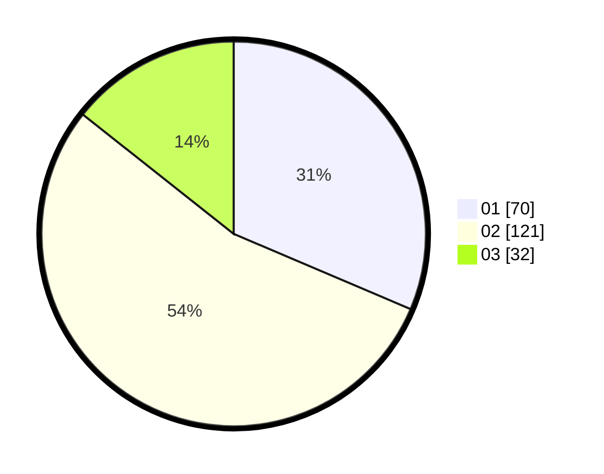

# Hasil

Hasil perolehan suara paslon dapat dilihat pada file paslon-01.txt, paslon-02.txt, dan paslon-03.txt.

Jika tidak ada, artinya data tersebut belum ada pada SIREKAP.

## Perolehan Suara

 * Paslon 01: **70**.
 * Paslon 02: **121**.
 * Paslon 03: **32**.

## Foto C Plano

https://sirekap-obj-formc.kpu.go.id/797f/pemilu/ppwp/31/74/05/10/05/3174051005145-20240219-171528--deeae77b-6af7-4da1-b6dd-55653c6b2df7.jpg

https://sirekap-obj-formc.kpu.go.id/797f/pemilu/ppwp/31/74/05/10/05/3174051005145-20240215-062253--1bdb461d-130c-495c-a870-6ac246bf6b0a.jpg

https://sirekap-obj-formc.kpu.go.id/797f/pemilu/ppwp/31/74/05/10/05/3174051005145-20240215-062321--ee949adf-b70e-45fe-a273-41982ad7c836.jpg

## DATA PEMILIH TETAP

Jumlah pemilih dalam DPT: **290**.
 * L: **143**.
 * P: **147**.

## DATA PENGGUNA HAK PILIH

Jumlah pengguna hak pilih dalam DPT: **226**.
 * L: **107**.
 * P: **119**.

Jumlah pengguna hak pilih dalam DPTb: **1**.
 * L: **1**.
 * P: **0**.

Jumlah pengguna hak pilih dalam DPK: **1**.
 * L: **1**.
 * P: **0**.

Jumlah pengguna hak pilih: **228**.
 * L: **109**.
 * P: **119**.

## JUMLAH SUARA SAH DAN TIDAK SAH

JUMLAH SELURUH SUARA SAH: **223**.

JUMLAH SUARA TIDAK SAH: **5**.

JUMLAH SELURUH SUARA SAH DAN SUARA TIDAK SAH: **228**.
