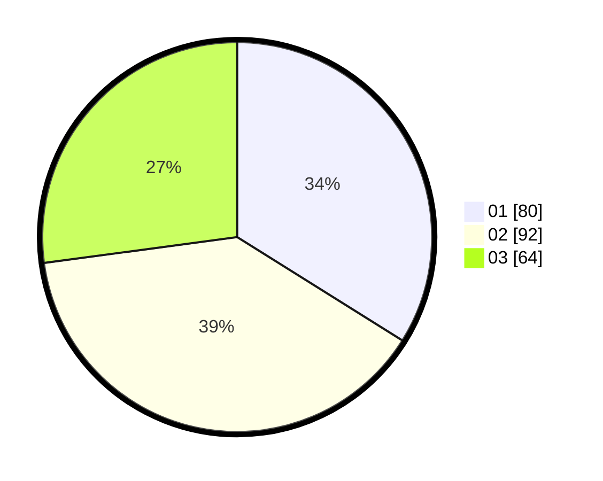

# Hasil

Hasil perolehan suara paslon dapat dilihat pada file paslon-01.txt, paslon-02.txt, dan paslon-03.txt.

Jika tidak ada, artinya data tersebut belum ada pada SIREKAP.

## Perolehan Suara

 * Paslon 01: **80**.
 * Paslon 02: **92**.
 * Paslon 03: **64**.

## Foto C Plano

https://sirekap-obj-formc.kpu.go.id/d38a/pemilu/ppwp/31/74/05/10/06/3174051006007-20240214-203434--d181b7c9-4c71-4bc3-864c-16bb6ccc74f2.jpg

https://sirekap-obj-formc.kpu.go.id/d38a/pemilu/ppwp/31/74/05/10/06/3174051006007-20240214-195750--07444849-806f-443d-9c57-0b6d56b4e3ed.jpg

https://sirekap-obj-formc.kpu.go.id/d38a/pemilu/ppwp/31/74/05/10/06/3174051006007-20240214-195846--7f218cd1-7f14-4eab-ac0a-d78c2ce6edd4.jpg

## DATA PEMILIH TETAP

Jumlah pemilih dalam DPT: **293**.
 * L: **535**.
 * P: **458**.

## DATA PENGGUNA HAK PILIH

Jumlah pengguna hak pilih dalam DPT: **222**.
 * L: **97**.
 * P: **125**.

Jumlah pengguna hak pilih dalam DPTb: **16**.
 * L: **10**.
 * P: **6**.

Jumlah pengguna hak pilih dalam DPK: **3**.
 * L: **2**.
 * P: **1**.

Jumlah pengguna hak pilih: **241**.
 * L: **109**.
 * P: **132**.

## JUMLAH SUARA SAH DAN TIDAK SAH

JUMLAH SELURUH SUARA SAH: **236**.

JUMLAH SUARA TIDAK SAH: **5**.

JUMLAH SELURUH SUARA SAH DAN SUARA TIDAK SAH: **241**.
