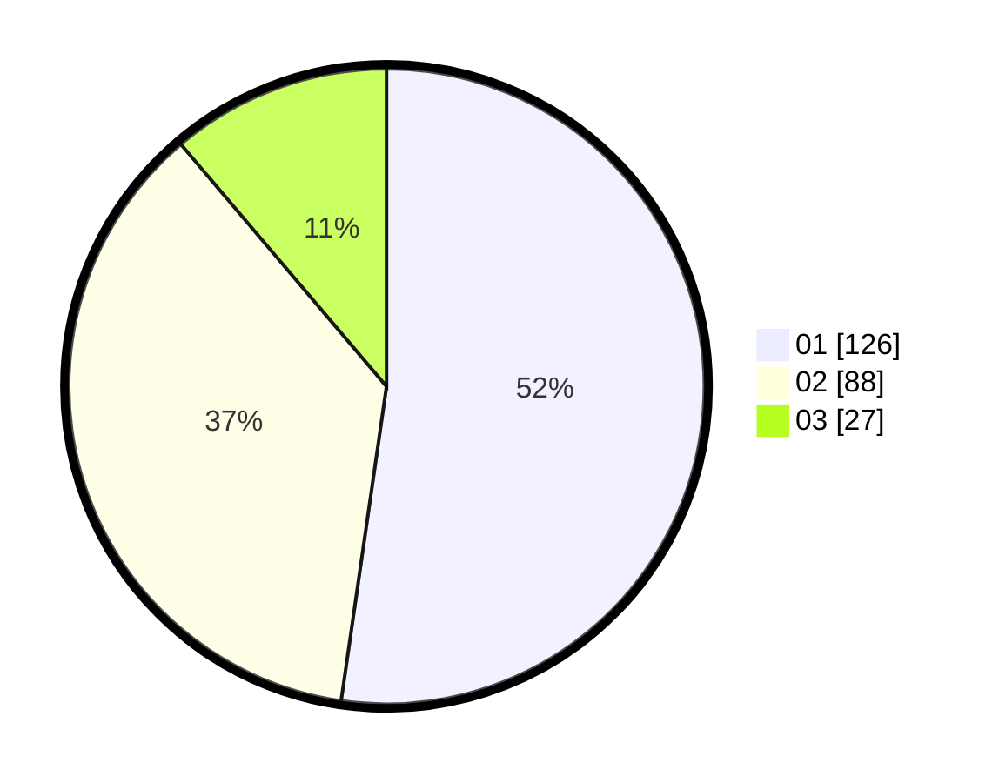

# Hasil

Hasil perolehan suara paslon dapat dilihat pada file paslon-01.txt, paslon-02.txt, dan paslon-03.txt.

Jika tidak ada, artinya data tersebut belum ada pada SIREKAP.

## Perolehan Suara

 * Paslon 01: **126**.
 * Paslon 02: **88**.
 * Paslon 03: **27**.

## Foto C Plano

https://sirekap-obj-formc.kpu.go.id/af46/pemilu/ppwp/31/74/05/10/06/3174051006008-20240214-194954--761b643e-de13-454f-99fd-26dd8b215b25.jpg

https://sirekap-obj-formc.kpu.go.id/af46/pemilu/ppwp/31/74/05/10/06/3174051006008-20240214-203136--84b6d67a-6fa7-419a-b37d-3ad92553b723.jpg

https://sirekap-obj-formc.kpu.go.id/af46/pemilu/ppwp/31/74/05/10/06/3174051006008-20240215-000605--079b87ee-1097-4bd4-878d-e98afca4940c.jpg

## DATA PEMILIH TETAP

Jumlah pemilih dalam DPT: **280**.
 * L: **134**.
 * P: **146**.

## DATA PENGGUNA HAK PILIH

Jumlah pengguna hak pilih dalam DPT: **233**.
 * L: **111**.
 * P: **122**.

Jumlah pengguna hak pilih dalam DPTb: **8**.
 * L: **7**.
 * P: **1**.

Jumlah pengguna hak pilih dalam DPK: **11**.
 * L: **5**.
 * P: **6**.

Jumlah pengguna hak pilih: **252**.
 * L: **123**.
 * P: **129**.

## JUMLAH SUARA SAH DAN TIDAK SAH

JUMLAH SELURUH SUARA SAH: **241**.

JUMLAH SUARA TIDAK SAH: **11**.

JUMLAH SELURUH SUARA SAH DAN SUARA TIDAK SAH: **252**.
