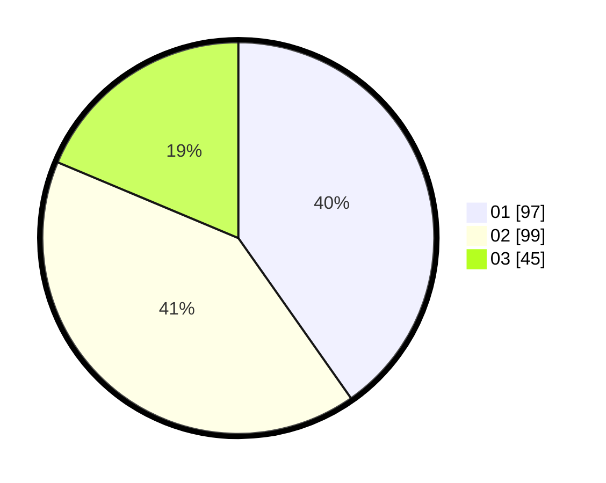

# Hasil

Hasil perolehan suara paslon dapat dilihat pada file paslon-01.txt, paslon-02.txt, dan paslon-03.txt.

Jika tidak ada, artinya data tersebut belum ada pada SIREKAP.

## Perolehan Suara

 * Paslon 01: **97**.
 * Paslon 02: **99**.
 * Paslon 03: **45**.

## Foto C Plano

https://sirekap-obj-formc.kpu.go.id/ed5a/pemilu/ppwp/31/74/05/10/06/3174051006011-20240214-215446--779704c0-894d-483d-b546-07ee39992f72.jpg

https://sirekap-obj-formc.kpu.go.id/ed5a/pemilu/ppwp/31/74/05/10/06/3174051006011-20240214-215745--ca2c0890-8c1a-4bb8-a31b-7420e70d740a.jpg

https://sirekap-obj-formc.kpu.go.id/ed5a/pemilu/ppwp/31/74/05/10/06/3174051006011-20240214-215840--eb263561-c677-4a36-ab8e-c68752caed16.jpg

## DATA PEMILIH TETAP

Jumlah pemilih dalam DPT: **295**.
 * L: **149**.
 * P: **146**.

## DATA PENGGUNA HAK PILIH

Jumlah pengguna hak pilih dalam DPT: **238**.
 * L: **117**.
 * P: **121**.

Jumlah pengguna hak pilih dalam DPTb: **7**.
 * L: **3**.
 * P: **4**.

Jumlah pengguna hak pilih dalam DPK: **1**.
 * L: **1**.
 * P: **0**.

Jumlah pengguna hak pilih: **246**.
 * L: **121**.
 * P: **125**.

## JUMLAH SUARA SAH DAN TIDAK SAH

JUMLAH SELURUH SUARA SAH: **241**.

JUMLAH SUARA TIDAK SAH: **5**.

JUMLAH SELURUH SUARA SAH DAN SUARA TIDAK SAH: **246**.
