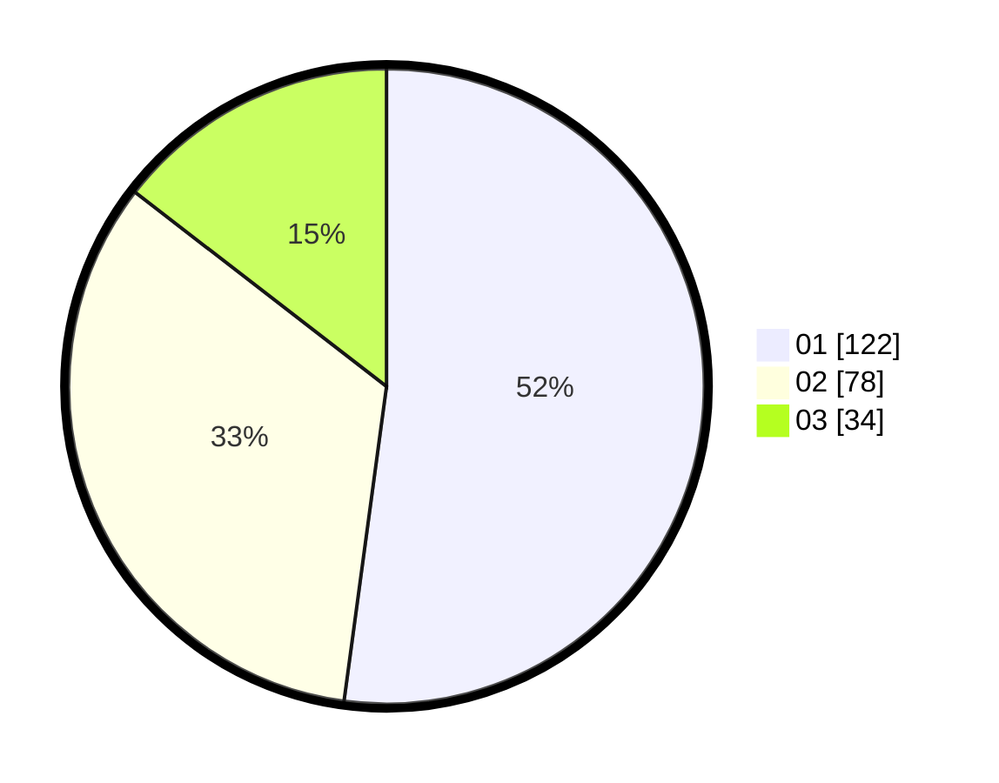

# Hasil

Hasil perolehan suara paslon dapat dilihat pada file paslon-01.txt, paslon-02.txt, dan paslon-03.txt.

Jika tidak ada, artinya data tersebut belum ada pada SIREKAP.

## Perolehan Suara

 * Paslon 01: **122**.
 * Paslon 02: **78**.
 * Paslon 03: **34**.

## Foto C Plano

https://sirekap-obj-formc.kpu.go.id/8f43/pemilu/ppwp/31/74/05/10/06/3174051006012-20240214-211546--c3e0612a-2627-4b62-9242-6fd1628e8c50.jpg

https://sirekap-obj-formc.kpu.go.id/8f43/pemilu/ppwp/31/74/05/10/06/3174051006012-20240214-211345--4629f1ce-608c-40db-84dc-253bf7ab42fa.jpg

https://sirekap-obj-formc.kpu.go.id/8f43/pemilu/ppwp/31/74/05/10/06/3174051006012-20240214-211229--7fb86d70-52b2-49bd-be07-cb9caf45802b.jpg

## DATA PEMILIH TETAP

Jumlah pemilih dalam DPT: **288**.
 * L: **150**.
 * P: **138**.

## DATA PENGGUNA HAK PILIH

Jumlah pengguna hak pilih dalam DPT: **235**.
 * L: **122**.
 * P: **113**.

Jumlah pengguna hak pilih dalam DPTb: **1**.
 * L: **1**.
 * P: **0**.

Jumlah pengguna hak pilih dalam DPK: **1**.
 * L: **1**.
 * P: **0**.

Jumlah pengguna hak pilih: **237**.
 * L: **124**.
 * P: **113**.

## JUMLAH SUARA SAH DAN TIDAK SAH

JUMLAH SELURUH SUARA SAH: **234**.

JUMLAH SUARA TIDAK SAH: **3**.

JUMLAH SELURUH SUARA SAH DAN SUARA TIDAK SAH: **237**.
