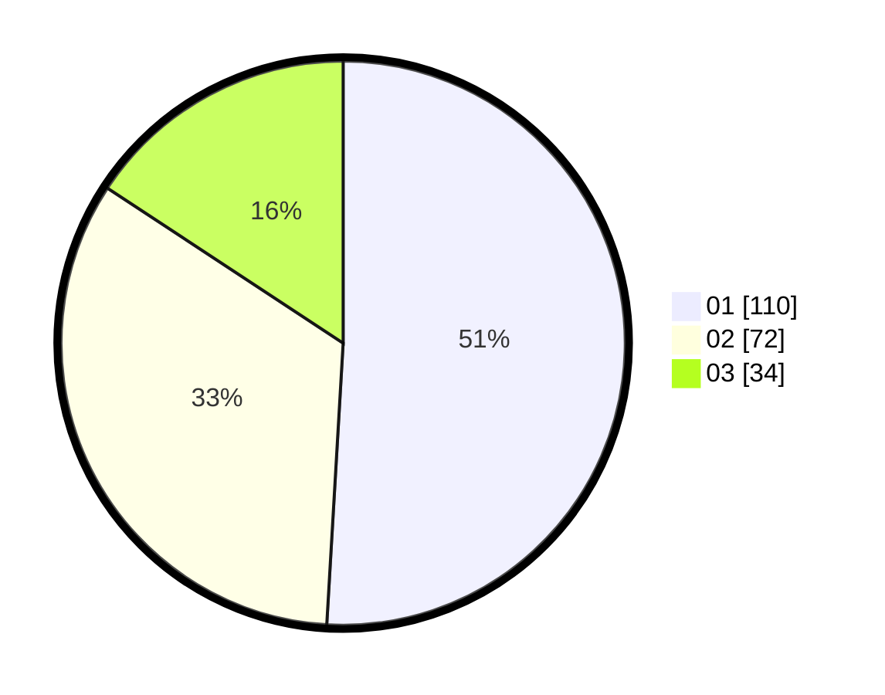

# Hasil

Hasil perolehan suara paslon dapat dilihat pada file paslon-01.txt, paslon-02.txt, dan paslon-03.txt.

Jika tidak ada, artinya data tersebut belum ada pada SIREKAP.

## Perolehan Suara

 * Paslon 01: **110**.
 * Paslon 02: **72**.
 * Paslon 03: **34**.

## Foto C Plano

https://sirekap-obj-formc.kpu.go.id/4560/pemilu/ppwp/31/74/05/10/06/3174051006014-20240215-004128--3a31b10b-4a3f-4e7f-8f30-3a340752ddfe.jpg

https://sirekap-obj-formc.kpu.go.id/4560/pemilu/ppwp/31/74/05/10/06/3174051006014-20240215-104005--915d1216-0bfb-4561-8a5d-17ce7969cdcb.jpg
