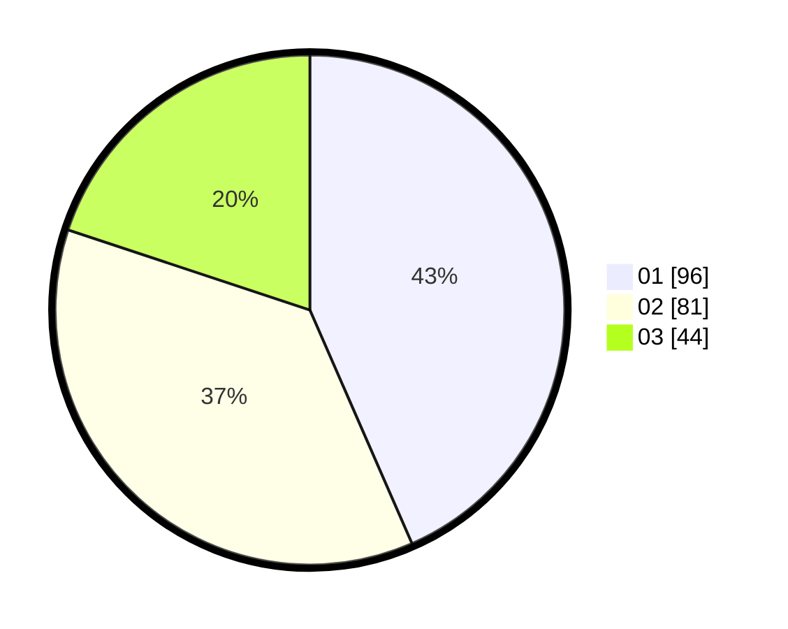

# Hasil

Hasil perolehan suara paslon dapat dilihat pada file paslon-01.txt, paslon-02.txt, dan paslon-03.txt.

Jika tidak ada, artinya data tersebut belum ada pada SIREKAP.

## Perolehan Suara

 * Paslon 01: **96**.
 * Paslon 02: **81**.
 * Paslon 03: **44**.

## Foto C Plano

https://sirekap-obj-formc.kpu.go.id/ac40/pemilu/ppwp/31/74/05/10/06/3174051006017-20240214-191511--b547b504-d4ec-4a9a-8726-2128dba32040.jpg

https://sirekap-obj-formc.kpu.go.id/ac40/pemilu/ppwp/31/74/05/10/06/3174051006017-20240214-191527--d326afa7-263d-4598-9977-ce416fc1460c.jpg

https://sirekap-obj-formc.kpu.go.id/ac40/pemilu/ppwp/31/74/05/10/06/3174051006017-20240214-191535--48bb6bba-4098-4872-aaec-528acb80b7b1.jpg

## DATA PEMILIH TETAP

Jumlah pemilih dalam DPT: **285**.
 * L: **143**.
 * P: **142**.

## DATA PENGGUNA HAK PILIH

Jumlah pengguna hak pilih dalam DPT: **224**.
 * L: **105**.
 * P: **119**.

Jumlah pengguna hak pilih dalam DPTb: **2**.
 * L: **1**.
 * P: **1**.

Jumlah pengguna hak pilih dalam DPK: **2**.
 * L: **1**.
 * P: **1**.

Jumlah pengguna hak pilih: **228**.
 * L: **107**.
 * P: **121**.

## JUMLAH SUARA SAH DAN TIDAK SAH

JUMLAH SELURUH SUARA SAH: **221**.

JUMLAH SUARA TIDAK SAH: **7**.

JUMLAH SELURUH SUARA SAH DAN SUARA TIDAK SAH: **228**.
