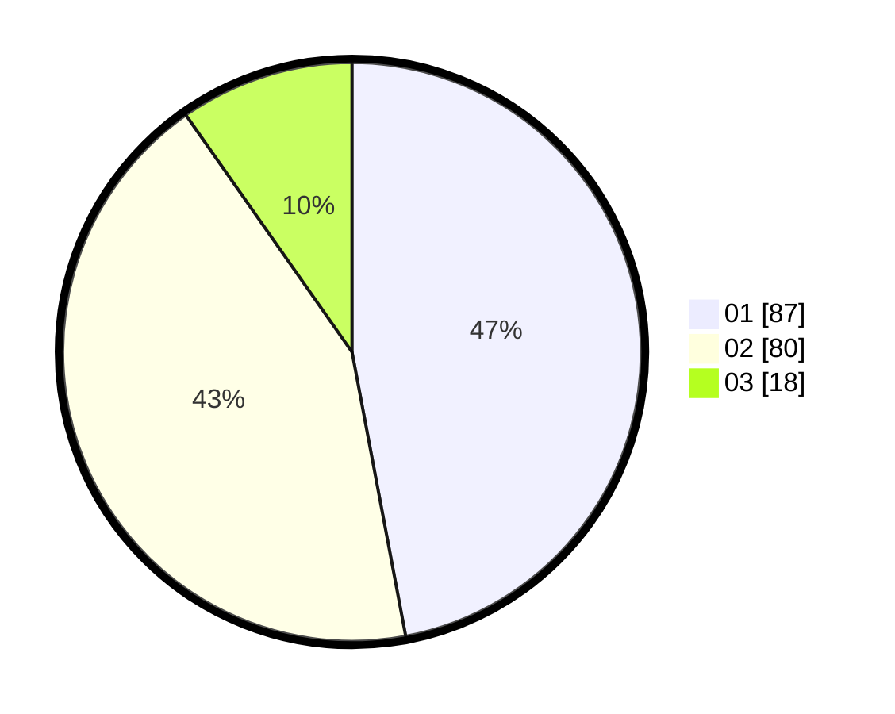

# Hasil

Hasil perolehan suara paslon dapat dilihat pada file paslon-01.txt, paslon-02.txt, dan paslon-03.txt.

Jika tidak ada, artinya data tersebut belum ada pada SIREKAP.

## Perolehan Suara

 * Paslon 01: **87**.
 * Paslon 02: **80**.
 * Paslon 03: **18**.

## Foto C Plano

https://sirekap-obj-formc.kpu.go.id/8477/pemilu/ppwp/31/74/05/10/06/3174051006033-20240214-192339--7f43fb92-2abb-40ba-b864-db2547deb87c.jpg

https://sirekap-obj-formc.kpu.go.id/8477/pemilu/ppwp/31/74/05/10/06/3174051006033-20240214-203332--bb1211af-ac15-468c-b906-90b5f5f5633e.jpg

https://sirekap-obj-formc.kpu.go.id/8477/pemilu/ppwp/31/74/05/10/06/3174051006033-20240214-191454--f8bbb598-7634-4bb1-9a95-8e1bf56eeaba.jpg

## DATA PEMILIH TETAP

Jumlah pemilih dalam DPT: **275**.
 * L: **140**.
 * P: **135**.

## DATA PENGGUNA HAK PILIH

Jumlah pengguna hak pilih dalam DPT: **185**.
 * L: **91**.
 * P: **94**.

Jumlah pengguna hak pilih dalam DPTb: **0**.
 * L: **0**.
 * P: **0**.

Jumlah pengguna hak pilih dalam DPK: **2**.
 * L: **0**.
 * P: **2**.

Jumlah pengguna hak pilih: **187**.
 * L: **91**.
 * P: **96**.

## JUMLAH SUARA SAH DAN TIDAK SAH

JUMLAH SELURUH SUARA SAH: **185**.

JUMLAH SUARA TIDAK SAH: **2**.

JUMLAH SELURUH SUARA SAH DAN SUARA TIDAK SAH: **187**.
