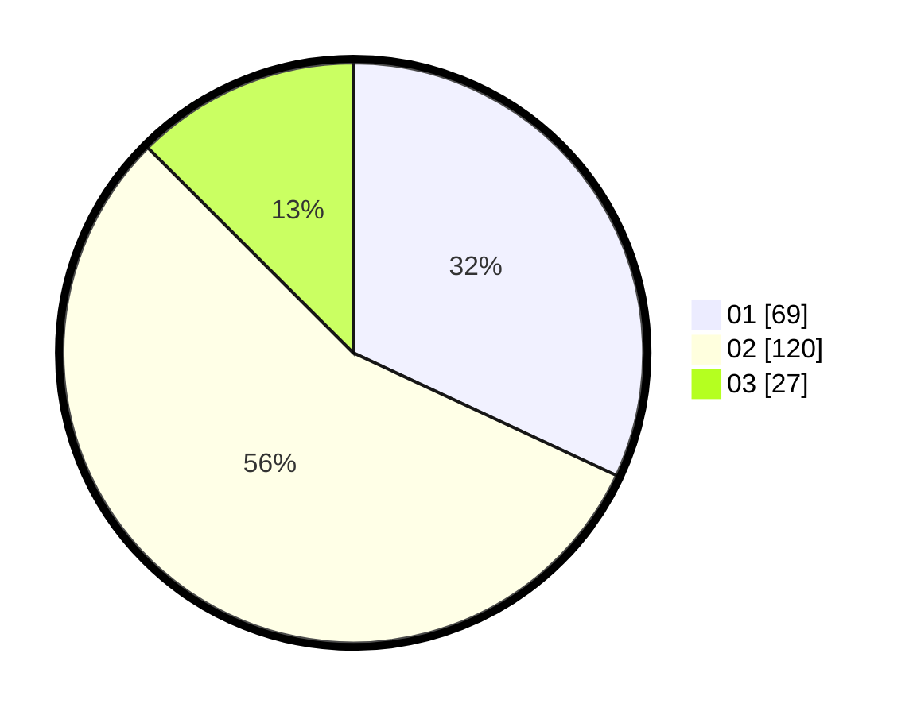

# Hasil

Hasil perolehan suara paslon dapat dilihat pada file paslon-01.txt, paslon-02.txt, dan paslon-03.txt.

Jika tidak ada, artinya data tersebut belum ada pada SIREKAP.

## Perolehan Suara

 * Paslon 01: **69**.
 * Paslon 02: **120**.
 * Paslon 03: **27**.

## Foto C Plano

https://sirekap-obj-formc.kpu.go.id/4c78/pemilu/ppwp/31/74/05/10/06/3174051006037-20240214-210748--93111064-b25c-4794-b7e1-fc7b071f2fc0.jpg

https://sirekap-obj-formc.kpu.go.id/4c78/pemilu/ppwp/31/74/05/10/06/3174051006037-20240214-210917--0aceed6a-8b59-4383-9df8-eaa4804016ab.jpg

https://sirekap-obj-formc.kpu.go.id/4c78/pemilu/ppwp/31/74/05/10/06/3174051006037-20240214-211110--0db6b939-b1d1-4554-af2d-1f350acefa16.jpg

## DATA PEMILIH TETAP

Jumlah pemilih dalam DPT: **256**.
 * L: **123**.
 * P: **133**.

## DATA PENGGUNA HAK PILIH

Jumlah pengguna hak pilih dalam DPT: **219**.
 * L: **103**.
 * P: **116**.

Jumlah pengguna hak pilih dalam DPTb: **3**.
 * L: **0**.
 * P: **3**.

Jumlah pengguna hak pilih dalam DPK: **0**.
 * L: **0**.
 * P: **0**.

Jumlah pengguna hak pilih: **222**.
 * L: **103**.
 * P: **119**.

## JUMLAH SUARA SAH DAN TIDAK SAH

JUMLAH SELURUH SUARA SAH: **216**.

JUMLAH SUARA TIDAK SAH: **6**.

JUMLAH SELURUH SUARA SAH DAN SUARA TIDAK SAH: **222**.
