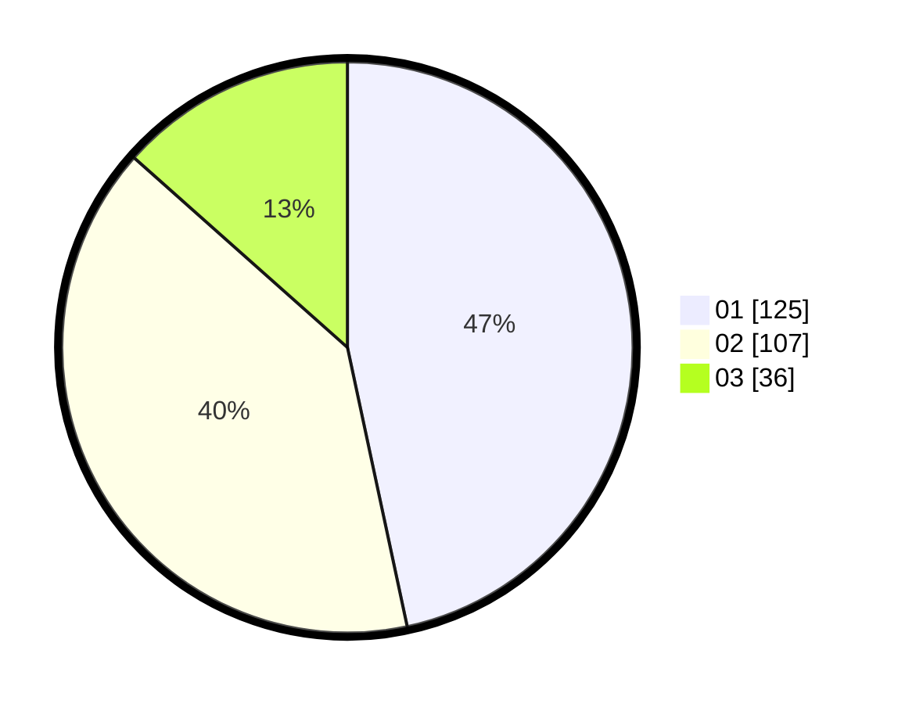

# Hasil

Hasil perolehan suara paslon dapat dilihat pada file paslon-01.txt, paslon-02.txt, dan paslon-03.txt.

Jika tidak ada, artinya data tersebut belum ada pada SIREKAP.

## Perolehan Suara

 * Paslon 01: **125**.
 * Paslon 02: **107**.
 * Paslon 03: **36**.

## Foto C Plano

https://sirekap-obj-formc.kpu.go.id/8886/pemilu/ppwp/31/74/05/10/06/3174051006042-20240214-184733--e3027d5d-771d-4fe0-ac91-984cf3c13aba.jpg

https://sirekap-obj-formc.kpu.go.id/8886/pemilu/ppwp/31/74/05/10/06/3174051006042-20240214-185750--ca409e60-1948-478e-85cb-d0c70c390ac1.jpg

https://sirekap-obj-formc.kpu.go.id/8886/pemilu/ppwp/31/74/05/10/06/3174051006042-20240214-184845--2665c3a6-6870-4493-819f-ea6c3d74c624.jpg

## DATA PEMILIH TETAP

Jumlah pemilih dalam DPT: **300**.
 * L: **151**.
 * P: **149**.

## DATA PENGGUNA HAK PILIH

Jumlah pengguna hak pilih dalam DPT: **261**.
 * L: **134**.
 * P: **127**.

Jumlah pengguna hak pilih dalam DPTb: **9**.
 * L: **3**.
 * P: **6**.

Jumlah pengguna hak pilih dalam DPK: **1**.
 * L: **1**.
 * P: **0**.

Jumlah pengguna hak pilih: **271**.
 * L: **138**.
 * P: **133**.

## JUMLAH SUARA SAH DAN TIDAK SAH

JUMLAH SELURUH SUARA SAH: **268**.

JUMLAH SUARA TIDAK SAH: **3**.

JUMLAH SELURUH SUARA SAH DAN SUARA TIDAK SAH: **271**.
