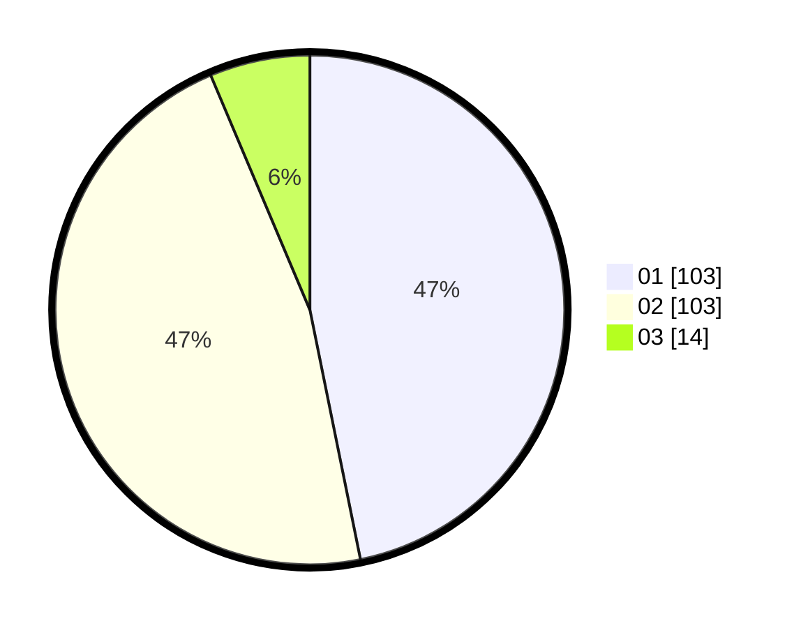

# Hasil

Hasil perolehan suara paslon dapat dilihat pada file paslon-01.txt, paslon-02.txt, dan paslon-03.txt.

Jika tidak ada, artinya data tersebut belum ada pada SIREKAP.

## Perolehan Suara

 * Paslon 01: **103**.
 * Paslon 02: **103**.
 * Paslon 03: **14**.

## Foto C Plano

https://sirekap-obj-formc.kpu.go.id/d689/pemilu/ppwp/31/74/05/10/06/3174051006044-20240215-113911--e19087e5-8b58-4759-8293-65dade0075b6.jpg

https://sirekap-obj-formc.kpu.go.id/d689/pemilu/ppwp/31/74/05/10/06/3174051006044-20240216-135943--7fe3a271-0c8f-49fa-b2c5-2dba48337652.jpg

https://sirekap-obj-formc.kpu.go.id/d689/pemilu/ppwp/31/74/05/10/06/3174051006044-20240216-140920--e8483ba4-7272-4441-8dc1-923668f8af58.jpg

## DATA PEMILIH TETAP

Jumlah pemilih dalam DPT: **298**.
 * L: **147**.
 * P: **151**.

## DATA PENGGUNA HAK PILIH

Jumlah pengguna hak pilih dalam DPT: **221**.
 * L: **101**.
 * P: **120**.

Jumlah pengguna hak pilih dalam DPTb: **1**.
 * L: **1**.
 * P: **0**.

Jumlah pengguna hak pilih dalam DPK: **1**.
 * L: **0**.
 * P: **1**.

Jumlah pengguna hak pilih: **223**.
 * L: **102**.
 * P: **121**.

## JUMLAH SUARA SAH DAN TIDAK SAH

JUMLAH SELURUH SUARA SAH: **220**.

JUMLAH SUARA TIDAK SAH: **3**.

JUMLAH SELURUH SUARA SAH DAN SUARA TIDAK SAH: **223**.
