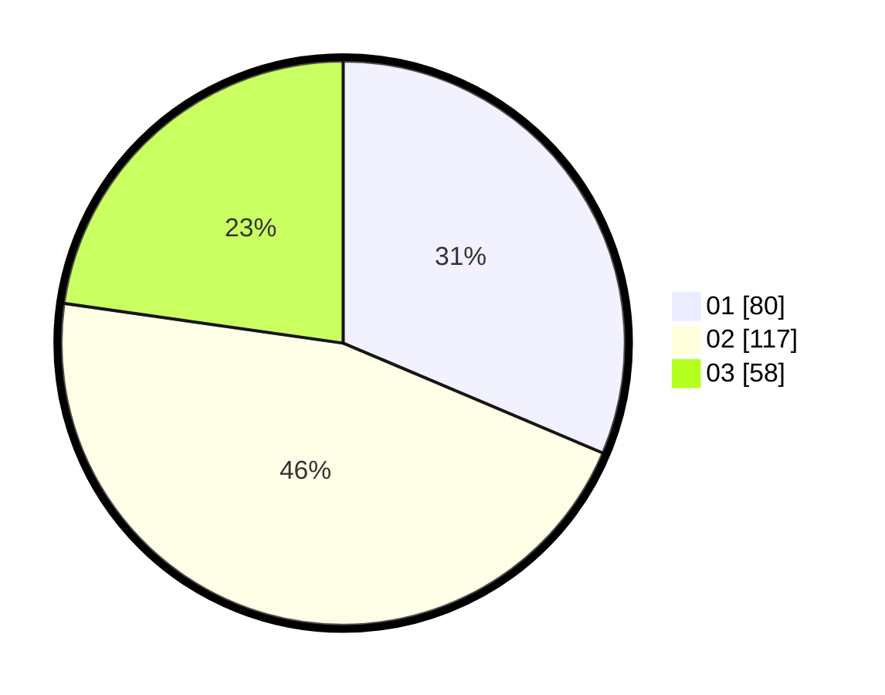

# Hasil

Hasil perolehan suara paslon dapat dilihat pada file paslon-01.txt, paslon-02.txt, dan paslon-03.txt.

Jika tidak ada, artinya data tersebut belum ada pada SIREKAP.

## Perolehan Suara

 * Paslon 01: **80**.
 * Paslon 02: **117**.
 * Paslon 03: **58**.

## Foto C Plano

https://sirekap-obj-formc.kpu.go.id/1d8a/pemilu/ppwp/31/74/05/10/06/3174051006048-20240216-125634--64d2c956-3385-4cf5-b94f-022888567b02.jpg

https://sirekap-obj-formc.kpu.go.id/1d8a/pemilu/ppwp/31/74/05/10/06/3174051006048-20240216-094654--96729fdf-003d-424a-b08b-48971fd40144.jpg

https://sirekap-obj-formc.kpu.go.id/1d8a/pemilu/ppwp/31/74/05/10/06/3174051006048-20240216-094646--e15c0776-d4d8-4d8c-9837-b95a740f61d9.jpg

## DATA PEMILIH TETAP

Jumlah pemilih dalam DPT: **259**.
 * L: **117**.
 * P: **142**.

## DATA PENGGUNA HAK PILIH

Jumlah pengguna hak pilih dalam DPT: **254**.
 * L: **114**.
 * P: **140**.

Jumlah pengguna hak pilih dalam DPTb: **3**.
 * L: **2**.
 * P: **1**.

Jumlah pengguna hak pilih dalam DPK: **2**.
 * L: **1**.
 * P: **1**.

Jumlah pengguna hak pilih: **259**.
 * L: **117**.
 * P: **142**.

## JUMLAH SUARA SAH DAN TIDAK SAH

JUMLAH SELURUH SUARA SAH: **255**.

JUMLAH SUARA TIDAK SAH: **4**.

JUMLAH SELURUH SUARA SAH DAN SUARA TIDAK SAH: **259**.
