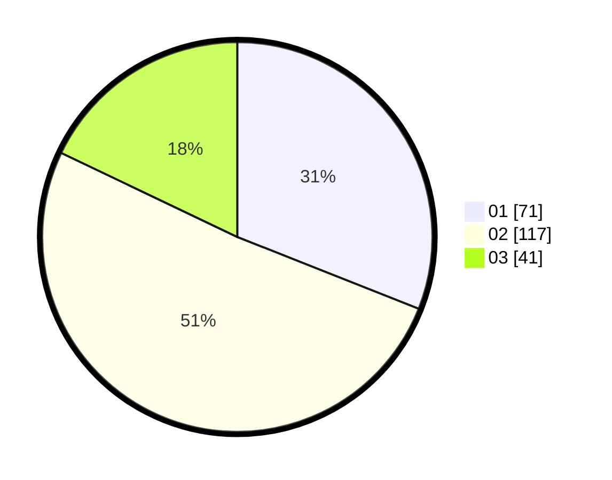

# Hasil

Hasil perolehan suara paslon dapat dilihat pada file paslon-01.txt, paslon-02.txt, dan paslon-03.txt.

Jika tidak ada, artinya data tersebut belum ada pada SIREKAP.

## Perolehan Suara

 * Paslon 01: **71**.
 * Paslon 02: **117**.
 * Paslon 03: **41**.

## Foto C Plano

https://sirekap-obj-formc.kpu.go.id/a07d/pemilu/ppwp/31/74/05/10/06/3174051006051-20240214-230132--6a5df164-edcd-432e-adf9-061691bf8b75.jpg

https://sirekap-obj-formc.kpu.go.id/a07d/pemilu/ppwp/31/74/05/10/06/3174051006051-20240214-230238--6f05b956-f55f-4f07-846c-81c6c457bb78.jpg

https://sirekap-obj-formc.kpu.go.id/a07d/pemilu/ppwp/31/74/05/10/06/3174051006051-20240214-230340--12000638-eb17-4579-936b-7cf4eb755e5d.jpg
