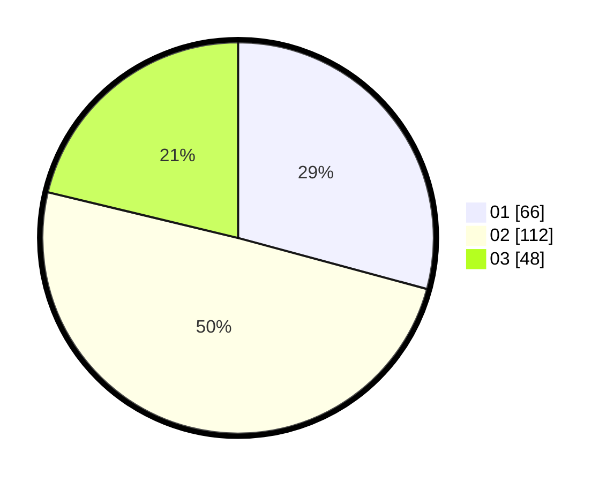

# Hasil

Hasil perolehan suara paslon dapat dilihat pada file paslon-01.txt, paslon-02.txt, dan paslon-03.txt.

Jika tidak ada, artinya data tersebut belum ada pada SIREKAP.

## Perolehan Suara

 * Paslon 01: **66**.
 * Paslon 02: **112**.
 * Paslon 03: **48**.

## Foto C Plano

https://sirekap-obj-formc.kpu.go.id/dbed/pemilu/ppwp/31/74/05/10/06/3174051006052-20240214-213614--be205f08-9503-4ce1-a99d-c2cbe4995694.jpg

https://sirekap-obj-formc.kpu.go.id/dbed/pemilu/ppwp/31/74/05/10/06/3174051006052-20240214-195054--f502ef78-a1b1-4029-9d7e-774cda6e0ff0.jpg

https://sirekap-obj-formc.kpu.go.id/dbed/pemilu/ppwp/31/74/05/10/06/3174051006052-20240214-195209--60791436-fa8e-4288-93d6-7c7032a22607.jpg

## DATA PEMILIH TETAP

Jumlah pemilih dalam DPT: **259**.
 * L: **126**.
 * P: **133**.

## DATA PENGGUNA HAK PILIH

Jumlah pengguna hak pilih dalam DPT: **224**.
 * L: **108**.
 * P: **116**.

Jumlah pengguna hak pilih dalam DPTb: **4**.
 * L: **2**.
 * P: **2**.

Jumlah pengguna hak pilih dalam DPK: **1**.
 * L: **1**.
 * P: **0**.

Jumlah pengguna hak pilih: **229**.
 * L: **111**.
 * P: **118**.

## JUMLAH SUARA SAH DAN TIDAK SAH

JUMLAH SELURUH SUARA SAH: **226**.

JUMLAH SUARA TIDAK SAH: **3**.

JUMLAH SELURUH SUARA SAH DAN SUARA TIDAK SAH: **229**.
