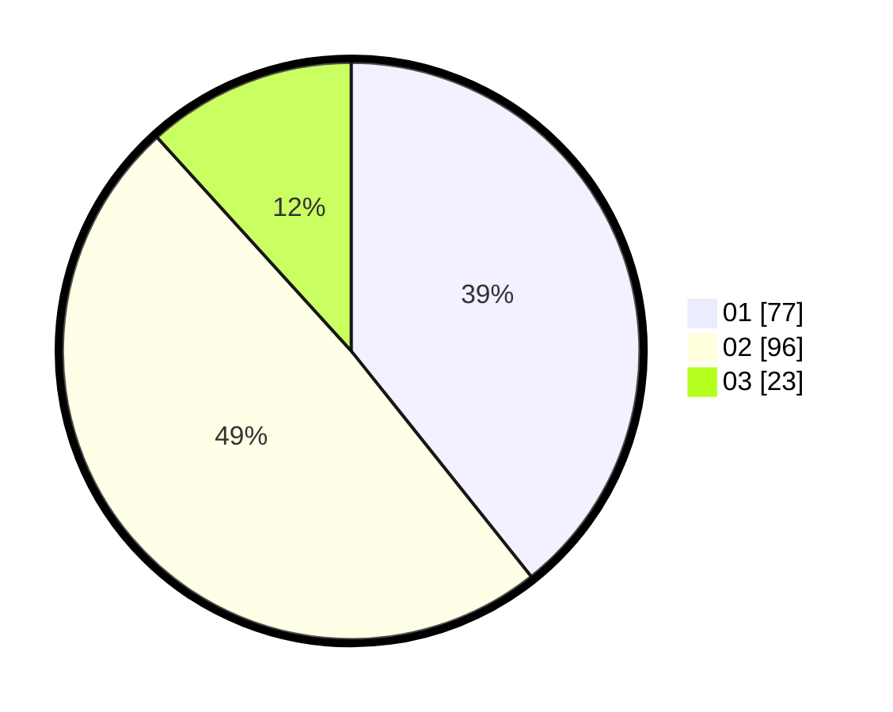

# Hasil

Hasil perolehan suara paslon dapat dilihat pada file paslon-01.txt, paslon-02.txt, dan paslon-03.txt.

Jika tidak ada, artinya data tersebut belum ada pada SIREKAP.

## Perolehan Suara

 * Paslon 01: **77**.
 * Paslon 02: **96**.
 * Paslon 03: **23**.

## Foto C Plano

https://sirekap-obj-formc.kpu.go.id/c9c8/pemilu/ppwp/31/74/05/10/06/3174051006059-20240215-000937--2f285d70-e78e-49f0-a231-abe371879eac.jpg

https://sirekap-obj-formc.kpu.go.id/c9c8/pemilu/ppwp/31/74/05/10/06/3174051006059-20240215-000957--a82eacbb-e431-41d0-b0c3-3b0e670ab5b1.jpg

https://sirekap-obj-formc.kpu.go.id/c9c8/pemilu/ppwp/31/74/05/10/06/3174051006059-20240215-001013--0ed6d2de-f466-4c4b-bb19-cde19f51016e.jpg

## DATA PEMILIH TETAP

Jumlah pemilih dalam DPT: **196**.
 * L: **84**.
 * P: **112**.

## DATA PENGGUNA HAK PILIH

Jumlah pengguna hak pilih dalam DPT: **197**.
 * L: **84**.
 * P: **113**.

Jumlah pengguna hak pilih dalam DPTb: **1**.
 * L: **0**.
 * P: **1**.

Jumlah pengguna hak pilih dalam DPK: **2**.
 * L: **2**.
 * P: **0**.

Jumlah pengguna hak pilih: **200**.
 * L: **86**.
 * P: **114**.

## JUMLAH SUARA SAH DAN TIDAK SAH

JUMLAH SELURUH SUARA SAH: **196**.

JUMLAH SUARA TIDAK SAH: **4**.

JUMLAH SELURUH SUARA SAH DAN SUARA TIDAK SAH: **200**.
