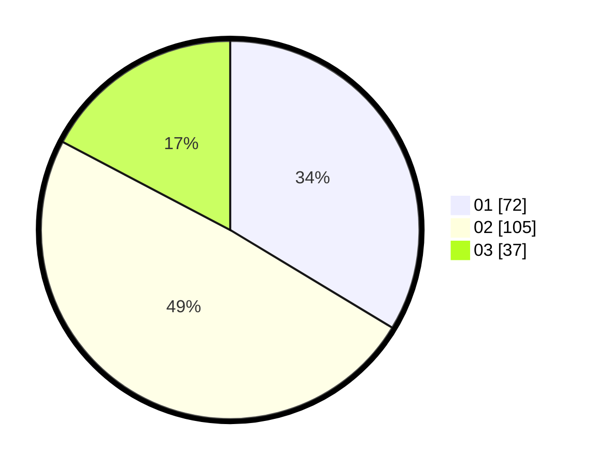

# Hasil

Hasil perolehan suara paslon dapat dilihat pada file paslon-01.txt, paslon-02.txt, dan paslon-03.txt.

Jika tidak ada, artinya data tersebut belum ada pada SIREKAP.

## Perolehan Suara

 * Paslon 01: **72**.
 * Paslon 02: **105**.
 * Paslon 03: **37**.

## Foto C Plano

https://sirekap-obj-formc.kpu.go.id/5919/pemilu/ppwp/31/74/05/10/06/3174051006061-20240214-155913--982b3fe3-028b-48f5-9ee8-873515719556.jpg

https://sirekap-obj-formc.kpu.go.id/5919/pemilu/ppwp/31/74/05/10/06/3174051006061-20240216-052515--9626a8cc-c940-41cf-a930-68591a4ec597.jpg

https://sirekap-obj-formc.kpu.go.id/5919/pemilu/ppwp/31/74/05/10/06/3174051006061-20240216-052510--37280185-83aa-44f9-9235-3f8114e148f5.jpg
