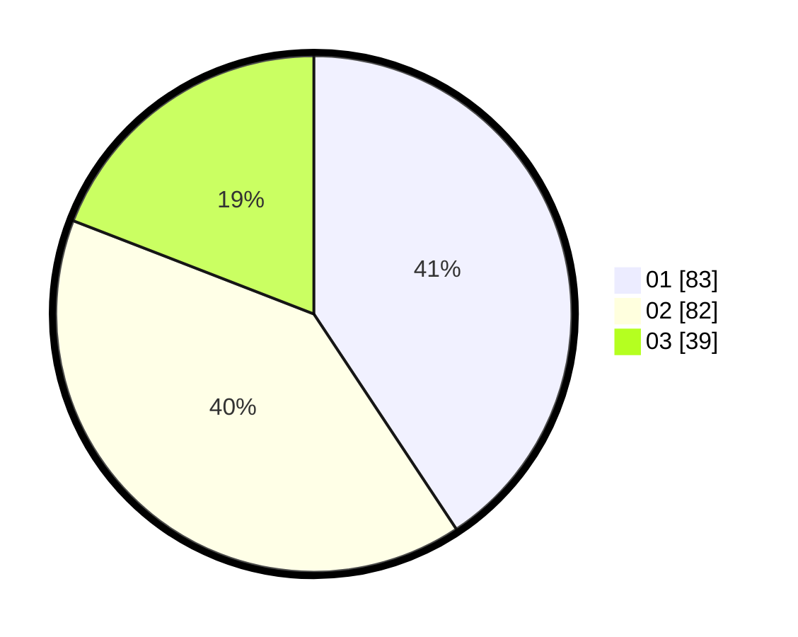

# Hasil

Hasil perolehan suara paslon dapat dilihat pada file paslon-01.txt, paslon-02.txt, dan paslon-03.txt.

Jika tidak ada, artinya data tersebut belum ada pada SIREKAP.

## Perolehan Suara

 * Paslon 01: **83**.
 * Paslon 02: **82**.
 * Paslon 03: **39**.

## Foto C Plano

https://sirekap-obj-formc.kpu.go.id/0813/pemilu/ppwp/31/74/05/10/06/3174051006068-20240214-191418--aceb5afb-2e07-4069-a25d-2ceb959fd343.jpg

https://sirekap-obj-formc.kpu.go.id/0813/pemilu/ppwp/31/74/05/10/06/3174051006068-20240214-191741--b1d9a450-091b-4d56-800b-98ef646826bf.jpg

https://sirekap-obj-formc.kpu.go.id/0813/pemilu/ppwp/31/74/05/10/06/3174051006068-20240214-192119--211c70c5-76dd-4dee-b5c6-7753020b0191.jpg

## DATA PEMILIH TETAP

Jumlah pemilih dalam DPT: **254**.
 * L: **105**.
 * P: **149**.

## DATA PENGGUNA HAK PILIH

Jumlah pengguna hak pilih dalam DPT: **205**.
 * L: **83**.
 * P: **122**.

Jumlah pengguna hak pilih dalam DPTb: **0**.
 * L: **0**.
 * P: **0**.

Jumlah pengguna hak pilih dalam DPK: **4**.
 * L: **3**.
 * P: **1**.

Jumlah pengguna hak pilih: **209**.
 * L: **86**.
 * P: **123**.

## JUMLAH SUARA SAH DAN TIDAK SAH

JUMLAH SELURUH SUARA SAH: **204**.

JUMLAH SUARA TIDAK SAH: **5**.

JUMLAH SELURUH SUARA SAH DAN SUARA TIDAK SAH: **209**.
