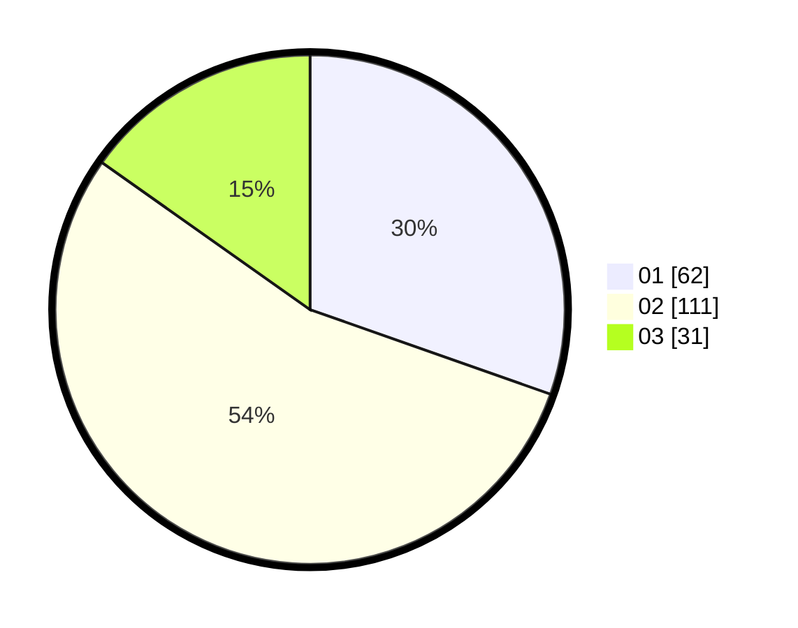

# Hasil

Hasil perolehan suara paslon dapat dilihat pada file paslon-01.txt, paslon-02.txt, dan paslon-03.txt.

Jika tidak ada, artinya data tersebut belum ada pada SIREKAP.

## Perolehan Suara

 * Paslon 01: **62**.
 * Paslon 02: **111**.
 * Paslon 03: **31**.

## Foto C Plano

https://sirekap-obj-formc.kpu.go.id/2964/pemilu/ppwp/31/74/05/10/06/3174051006071-20240214-155351--baacb969-1290-45f9-adb0-3ea7cc9a3959.jpg

https://sirekap-obj-formc.kpu.go.id/2964/pemilu/ppwp/31/74/05/10/06/3174051006071-20240214-160115--f0a292d3-a2b2-4026-97d9-34b7065f4154.jpg

https://sirekap-obj-formc.kpu.go.id/2964/pemilu/ppwp/31/74/05/10/06/3174051006071-20240214-155444--0a8559d9-d375-4acb-8c0a-f7ec486cc3aa.jpg

## DATA PEMILIH TETAP

Jumlah pemilih dalam DPT: **257**.
 * L: **126**.
 * P: **131**.

## DATA PENGGUNA HAK PILIH

Jumlah pengguna hak pilih dalam DPT: **207**.
 * L: **99**.
 * P: **108**.

Jumlah pengguna hak pilih dalam DPTb: **0**.
 * L: **0**.
 * P: **0**.

Jumlah pengguna hak pilih dalam DPK: **0**.
 * L: **0**.
 * P: **0**.

Jumlah pengguna hak pilih: **207**.
 * L: **99**.
 * P: **108**.

## JUMLAH SUARA SAH DAN TIDAK SAH

JUMLAH SELURUH SUARA SAH: **204**.

JUMLAH SUARA TIDAK SAH: **3**.

JUMLAH SELURUH SUARA SAH DAN SUARA TIDAK SAH: **207**.
