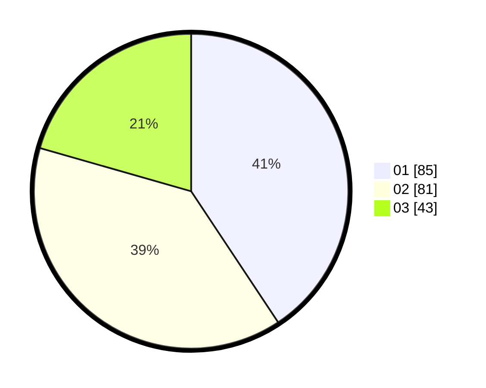

# Hasil

Hasil perolehan suara paslon dapat dilihat pada file paslon-01.txt, paslon-02.txt, dan paslon-03.txt.

Jika tidak ada, artinya data tersebut belum ada pada SIREKAP.

## Perolehan Suara

 * Paslon 01: **85**.
 * Paslon 02: **81**.
 * Paslon 03: **43**.

## Foto C Plano

https://sirekap-obj-formc.kpu.go.id/a27f/pemilu/ppwp/31/74/05/10/06/3174051006077-20240216-030357--7831aa26-0ae6-40e9-97e6-ba794421f49d.jpg

https://sirekap-obj-formc.kpu.go.id/a27f/pemilu/ppwp/31/74/05/10/06/3174051006077-20240216-030417--d78bb94b-70e3-407e-a753-5baf11cfcbdd.jpg

https://sirekap-obj-formc.kpu.go.id/a27f/pemilu/ppwp/31/74/05/10/06/3174051006077-20240214-194041--1394c697-f507-4b0d-940f-f791f2cff7ed.jpg

## DATA PEMILIH TETAP

Jumlah pemilih dalam DPT: **261**.
 * L: **131**.
 * P: **130**.

## DATA PENGGUNA HAK PILIH

Jumlah pengguna hak pilih dalam DPT: **202**.
 * L: **94**.
 * P: **108**.

Jumlah pengguna hak pilih dalam DPTb: **7**.
 * L: **4**.
 * P: **3**.

Jumlah pengguna hak pilih dalam DPK: **3**.
 * L: **2**.
 * P: **1**.

Jumlah pengguna hak pilih: **212**.
 * L: **100**.
 * P: **112**.

## JUMLAH SUARA SAH DAN TIDAK SAH

JUMLAH SELURUH SUARA SAH: **209**.

JUMLAH SUARA TIDAK SAH: **3**.

JUMLAH SELURUH SUARA SAH DAN SUARA TIDAK SAH: **212**.
