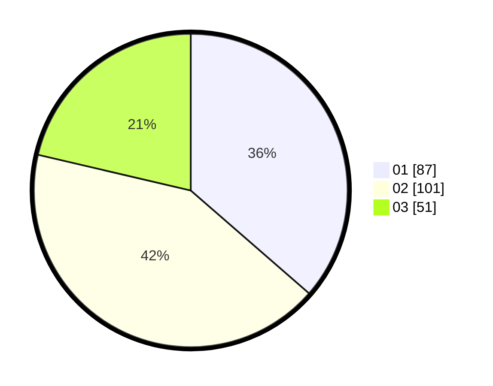

# Hasil

Hasil perolehan suara paslon dapat dilihat pada file paslon-01.txt, paslon-02.txt, dan paslon-03.txt.

Jika tidak ada, artinya data tersebut belum ada pada SIREKAP.

## Perolehan Suara

 * Paslon 01: **87**.
 * Paslon 02: **101**.
 * Paslon 03: **51**.

## Foto C Plano

https://sirekap-obj-formc.kpu.go.id/f113/pemilu/ppwp/31/74/05/10/06/3174051006097-20240214-201314--c933e2e7-f91a-4c48-8dd7-2b525f751188.jpg

https://sirekap-obj-formc.kpu.go.id/f113/pemilu/ppwp/31/74/05/10/06/3174051006097-20240214-201534--87908a1e-250d-40b5-a400-72fe9658f34f.jpg

https://sirekap-obj-formc.kpu.go.id/f113/pemilu/ppwp/31/74/05/10/06/3174051006097-20240215-002052--cde98ec9-f2f6-441f-a417-b7d5f9c8ec21.jpg

## DATA PEMILIH TETAP

Jumlah pemilih dalam DPT: **299**.
 * L: **151**.
 * P: **148**.

## DATA PENGGUNA HAK PILIH

Jumlah pengguna hak pilih dalam DPT: **237**.
 * L: **116**.
 * P: **121**.

Jumlah pengguna hak pilih dalam DPTb: **2**.
 * L: **1**.
 * P: **1**.

Jumlah pengguna hak pilih dalam DPK: **2**.
 * L: **2**.
 * P: **0**.

Jumlah pengguna hak pilih: **241**.
 * L: **119**.
 * P: **122**.

## JUMLAH SUARA SAH DAN TIDAK SAH

JUMLAH SELURUH SUARA SAH: **239**.

JUMLAH SUARA TIDAK SAH: **2**.

JUMLAH SELURUH SUARA SAH DAN SUARA TIDAK SAH: **241**.
