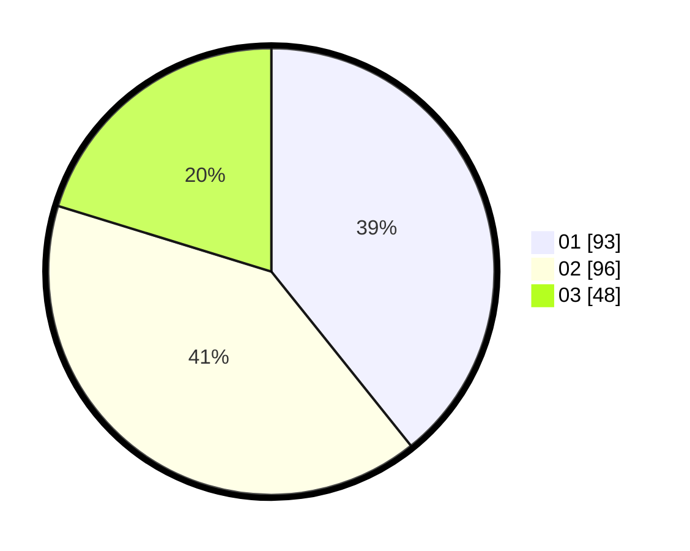

# Hasil

Hasil perolehan suara paslon dapat dilihat pada file paslon-01.txt, paslon-02.txt, dan paslon-03.txt.

Jika tidak ada, artinya data tersebut belum ada pada SIREKAP.

## Perolehan Suara

 * Paslon 01: **93**.
 * Paslon 02: **96**.
 * Paslon 03: **48**.

## Foto C Plano

https://sirekap-obj-formc.kpu.go.id/554a/pemilu/ppwp/31/74/05/10/06/3174051006098-20240215-230710--6cb8a0b2-7a7e-417b-a29c-2b6f81546f4d.jpg

https://sirekap-obj-formc.kpu.go.id/554a/pemilu/ppwp/31/74/05/10/06/3174051006098-20240215-230711--d7a14b43-5b23-4549-8ae2-859be166a6a6.jpg

https://sirekap-obj-formc.kpu.go.id/554a/pemilu/ppwp/31/74/05/10/06/3174051006098-20240215-230711--4385b61b-83f8-4927-b114-e16ba3343a77.jpg

## DATA PEMILIH TETAP

Jumlah pemilih dalam DPT: **297**.
 * L: **150**.
 * P: **147**.

## DATA PENGGUNA HAK PILIH

Jumlah pengguna hak pilih dalam DPT: **235**.
 * L: **113**.
 * P: **122**.

Jumlah pengguna hak pilih dalam DPTb: **2**.
 * L: **1**.
 * P: **1**.

Jumlah pengguna hak pilih dalam DPK: **1**.
 * L: **0**.
 * P: **1**.

Jumlah pengguna hak pilih: **238**.
 * L: **114**.
 * P: **124**.

## JUMLAH SUARA SAH DAN TIDAK SAH

JUMLAH SELURUH SUARA SAH: **237**.

JUMLAH SUARA TIDAK SAH: **1**.

JUMLAH SELURUH SUARA SAH DAN SUARA TIDAK SAH: **238**.
