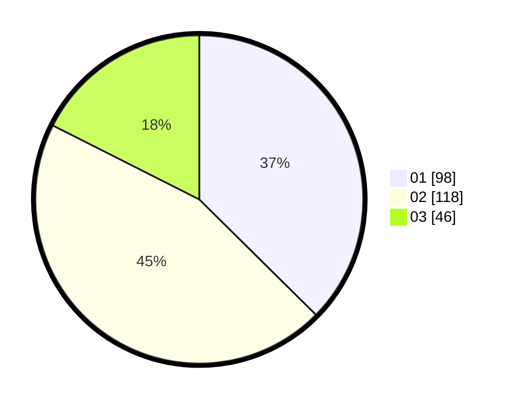

# Hasil

Hasil perolehan suara paslon dapat dilihat pada file paslon-01.txt, paslon-02.txt, dan paslon-03.txt.

Jika tidak ada, artinya data tersebut belum ada pada SIREKAP.

## Perolehan Suara

 * Paslon 01: **98**.
 * Paslon 02: **118**.
 * Paslon 03: **46**.

## Foto C Plano

https://sirekap-obj-formc.kpu.go.id/daa8/pemilu/ppwp/31/74/05/10/06/3174051006101-20240216-083153--7fbaa6f5-13da-4581-b245-36e7afebc98a.jpg

https://sirekap-obj-formc.kpu.go.id/daa8/pemilu/ppwp/31/74/05/10/06/3174051006101-20240216-083154--f9424283-53c6-449a-9fd0-ff2970f961f4.jpg

https://sirekap-obj-formc.kpu.go.id/daa8/pemilu/ppwp/31/74/05/10/06/3174051006101-20240216-083154--4b18c483-1bc2-4952-b740-9651727a932c.jpg

## DATA PEMILIH TETAP

Jumlah pemilih dalam DPT: **296**.
 * L: **138**.
 * P: **158**.

## DATA PENGGUNA HAK PILIH

Jumlah pengguna hak pilih dalam DPT: **263**.
 * L: **124**.
 * P: **139**.

Jumlah pengguna hak pilih dalam DPTb: **3**.
 * L: **1**.
 * P: **2**.

Jumlah pengguna hak pilih dalam DPK: **1**.
 * L: **1**.
 * P: **0**.

Jumlah pengguna hak pilih: **267**.
 * L: **126**.
 * P: **141**.

## JUMLAH SUARA SAH DAN TIDAK SAH

JUMLAH SELURUH SUARA SAH: **262**.

JUMLAH SUARA TIDAK SAH: **5**.

JUMLAH SELURUH SUARA SAH DAN SUARA TIDAK SAH: **267**.
