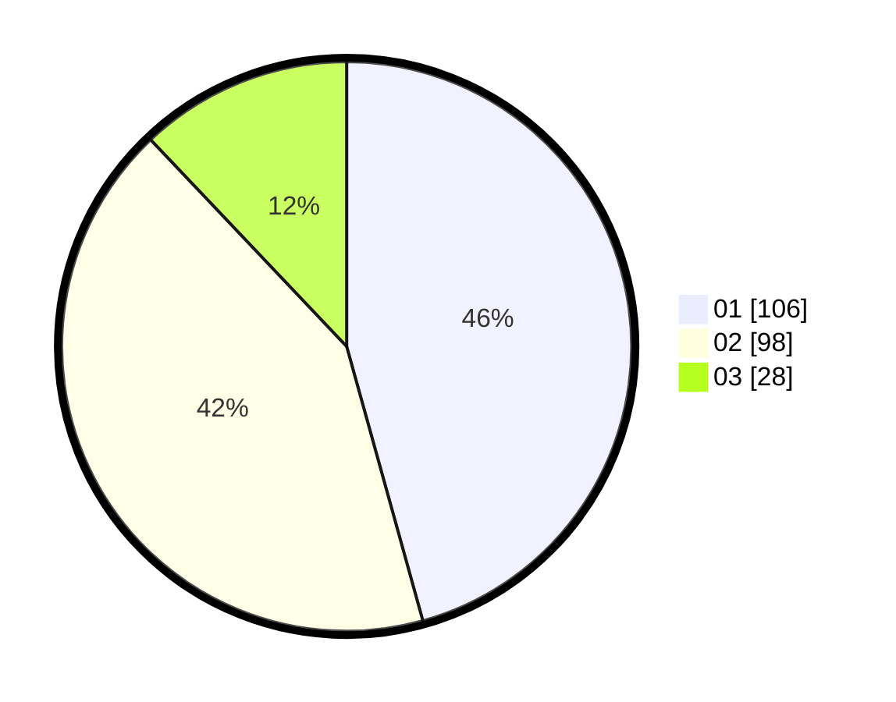

# Hasil

Hasil perolehan suara paslon dapat dilihat pada file paslon-01.txt, paslon-02.txt, dan paslon-03.txt.

Jika tidak ada, artinya data tersebut belum ada pada SIREKAP.

## Perolehan Suara

 * Paslon 01: **106**.
 * Paslon 02: **98**.
 * Paslon 03: **28**.

## Foto C Plano

https://sirekap-obj-formc.kpu.go.id/2bd1/pemilu/ppwp/31/74/05/10/06/3174051006106-20240214-204921--6b7e6eeb-7a8e-4b83-a20d-916a711e9772.jpg

https://sirekap-obj-formc.kpu.go.id/2bd1/pemilu/ppwp/31/74/05/10/06/3174051006106-20240214-202133--8e52384c-e077-4cda-ac30-2db8d7a0b61c.jpg

https://sirekap-obj-formc.kpu.go.id/2bd1/pemilu/ppwp/31/74/05/10/06/3174051006106-20240214-202524--723a5f63-f73f-44d6-a998-39866adad610.jpg
