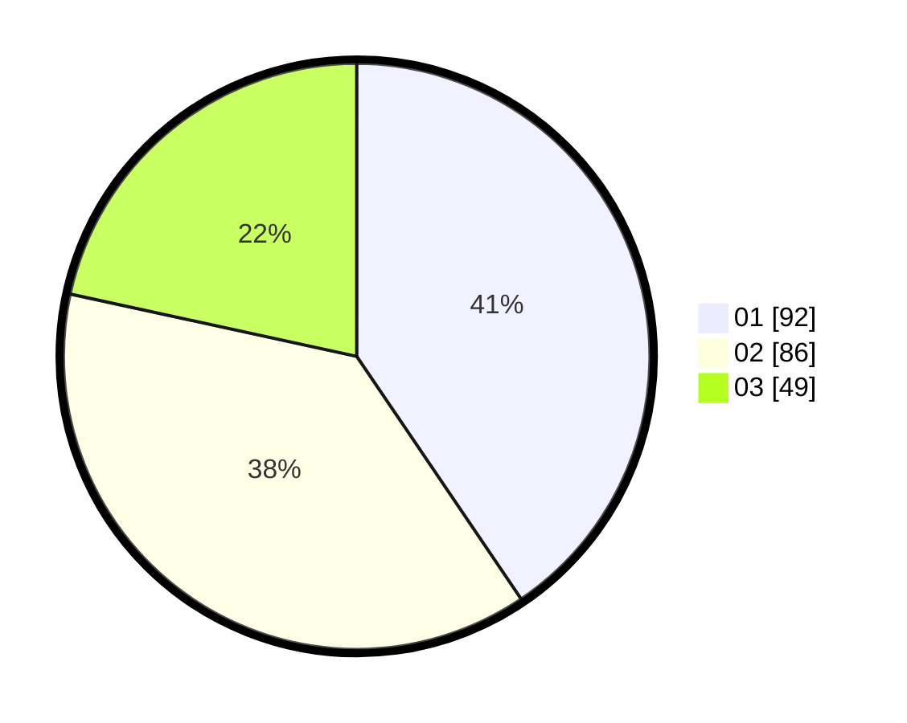

# Hasil

Hasil perolehan suara paslon dapat dilihat pada file paslon-01.txt, paslon-02.txt, dan paslon-03.txt.

Jika tidak ada, artinya data tersebut belum ada pada SIREKAP.

## Perolehan Suara

 * Paslon 01: **92**.
 * Paslon 02: **86**.
 * Paslon 03: **49**.

## Foto C Plano

https://sirekap-obj-formc.kpu.go.id/34bd/pemilu/ppwp/31/74/05/10/06/3174051006126-20240214-201140--d5f96742-fae0-449a-a9ff-dabfede6d416.jpg

https://sirekap-obj-formc.kpu.go.id/34bd/pemilu/ppwp/31/74/05/10/06/3174051006126-20240214-205302--fb5c62e9-f802-455a-ba1f-f262557a2948.jpg

https://sirekap-obj-formc.kpu.go.id/34bd/pemilu/ppwp/31/74/05/10/06/3174051006126-20240214-211519--113b85c8-69f8-4fc7-a1c8-30d566b8e536.jpg

## DATA PEMILIH TETAP

Jumlah pemilih dalam DPT: **269**.
 * L: **127**.
 * P: **142**.

## DATA PENGGUNA HAK PILIH

Jumlah pengguna hak pilih dalam DPT: **227**.
 * L: **100**.
 * P: **127**.

Jumlah pengguna hak pilih dalam DPTb: **3**.
 * L: **0**.
 * P: **3**.

Jumlah pengguna hak pilih dalam DPK: **2**.
 * L: **2**.
 * P: **0**.

Jumlah pengguna hak pilih: **232**.
 * L: **102**.
 * P: **130**.

## JUMLAH SUARA SAH DAN TIDAK SAH

JUMLAH SELURUH SUARA SAH: **227**.

JUMLAH SUARA TIDAK SAH: **5**.

JUMLAH SELURUH SUARA SAH DAN SUARA TIDAK SAH: **232**.
