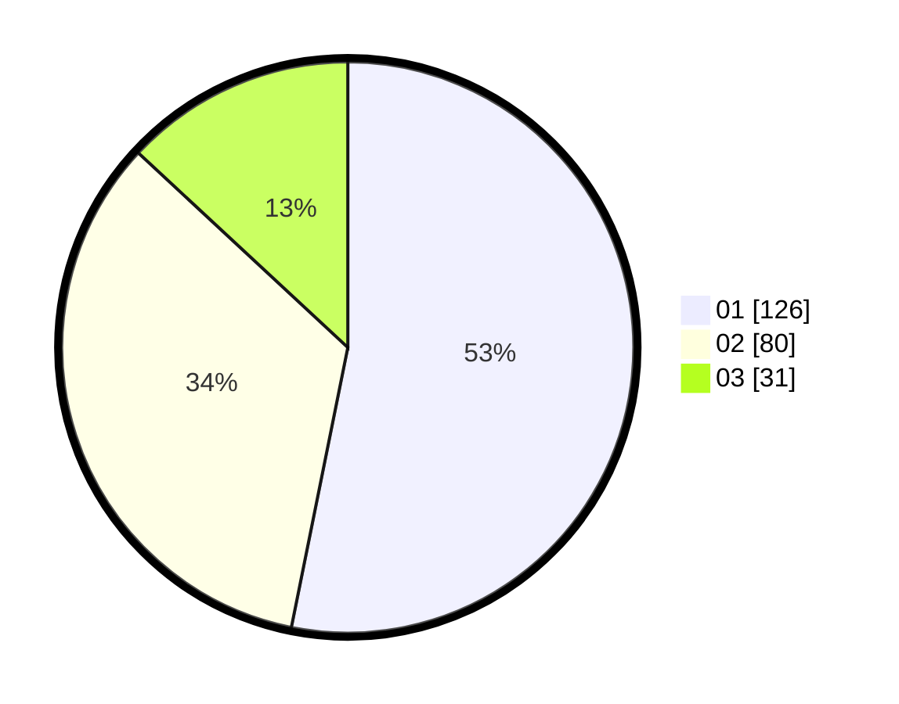

# Hasil

Hasil perolehan suara paslon dapat dilihat pada file paslon-01.txt, paslon-02.txt, dan paslon-03.txt.

Jika tidak ada, artinya data tersebut belum ada pada SIREKAP.

## Perolehan Suara

 * Paslon 01: **126**.
 * Paslon 02: **80**.
 * Paslon 03: **31**.

## Foto C Plano

https://sirekap-obj-formc.kpu.go.id/e523/pemilu/ppwp/31/74/05/10/06/3174051006129-20240215-031643--a5e9297d-2f07-437b-a529-fb612f5a68b2.jpg

https://sirekap-obj-formc.kpu.go.id/e523/pemilu/ppwp/31/74/05/10/06/3174051006129-20240215-025519--d512e70e-e328-4455-abe3-1263e3c3ebcd.jpg

https://sirekap-obj-formc.kpu.go.id/e523/pemilu/ppwp/31/74/05/10/06/3174051006129-20240215-025525--fd9de710-85c9-492a-84df-e65772f20859.jpg
