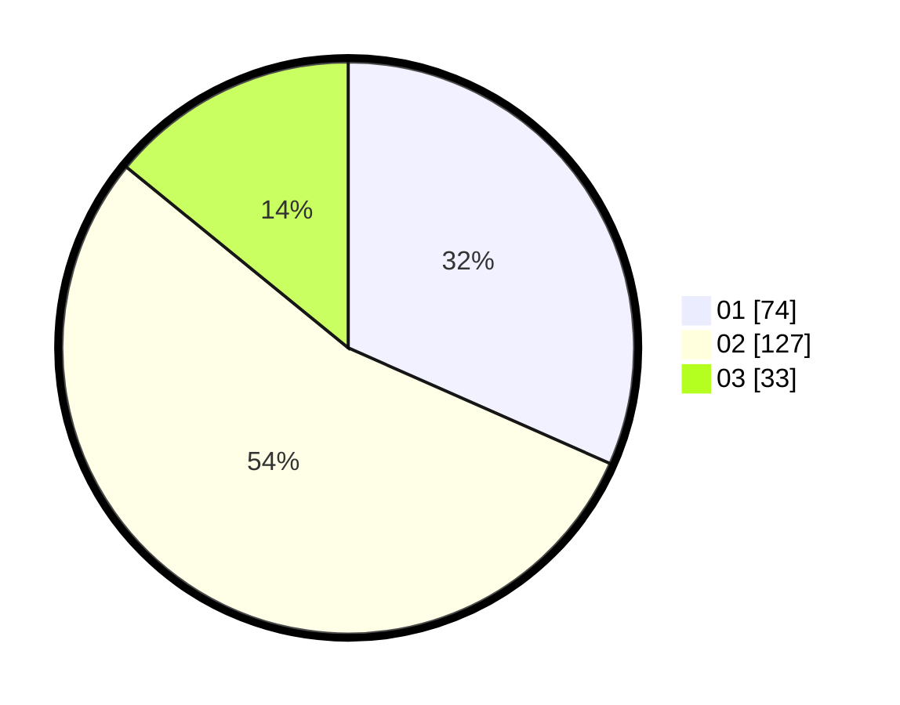

# Hasil

Hasil perolehan suara paslon dapat dilihat pada file paslon-01.txt, paslon-02.txt, dan paslon-03.txt.

Jika tidak ada, artinya data tersebut belum ada pada SIREKAP.

## Perolehan Suara

 * Paslon 01: **74**.
 * Paslon 02: **127**.
 * Paslon 03: **33**.

## Foto C Plano

https://sirekap-obj-formc.kpu.go.id/8cd0/pemilu/ppwp/31/74/05/10/06/3174051006130-20240214-162224--12df26e8-f967-4238-aec8-87d35572bcc5.jpg

https://sirekap-obj-formc.kpu.go.id/8cd0/pemilu/ppwp/31/74/05/10/06/3174051006130-20240214-184853--27868425-a77e-405d-8bc7-c14a0d519b06.jpg

https://sirekap-obj-formc.kpu.go.id/8cd0/pemilu/ppwp/31/74/05/10/06/3174051006130-20240214-184949--78ca60ae-c285-4a7a-88a9-85ad07482f54.jpg

## DATA PEMILIH TETAP

Jumlah pemilih dalam DPT: **281**.
 * L: **138**.
 * P: **143**.

## DATA PENGGUNA HAK PILIH

Jumlah pengguna hak pilih dalam DPT: **241**.
 * L: **138**.
 * P: **143**.

Jumlah pengguna hak pilih dalam DPTb: **1**.
 * L: **0**.
 * P: **1**.

Jumlah pengguna hak pilih dalam DPK: **4**.
 * L: **3**.
 * P: **1**.

Jumlah pengguna hak pilih: **235**.
 * L: **117**.
 * P: **118**.

## JUMLAH SUARA SAH DAN TIDAK SAH

JUMLAH SELURUH SUARA SAH: **234**.

JUMLAH SUARA TIDAK SAH: **1**.

JUMLAH SELURUH SUARA SAH DAN SUARA TIDAK SAH: **235**.
