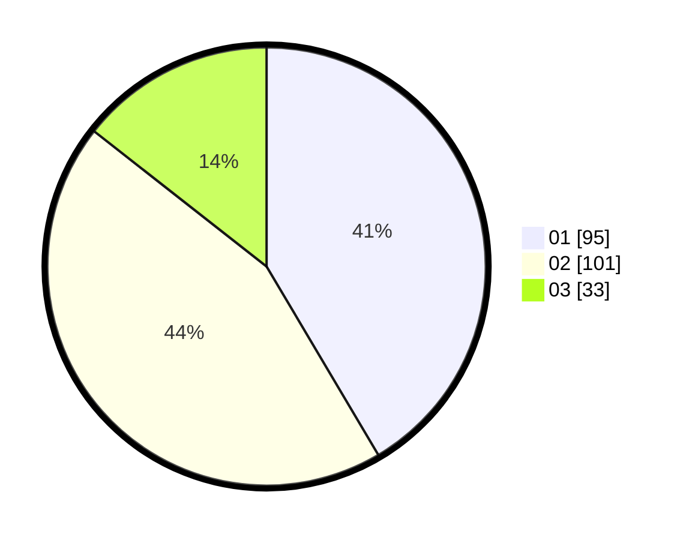

# Hasil

Hasil perolehan suara paslon dapat dilihat pada file paslon-01.txt, paslon-02.txt, dan paslon-03.txt.

Jika tidak ada, artinya data tersebut belum ada pada SIREKAP.

## Perolehan Suara

 * Paslon 01: **95**.
 * Paslon 02: **101**.
 * Paslon 03: **33**.

## Foto C Plano

https://sirekap-obj-formc.kpu.go.id/1b3c/pemilu/ppwp/31/74/05/10/06/3174051006134-20240214-160107--61af774f-fa08-4528-aeb2-e7bc9377534b.jpg

https://sirekap-obj-formc.kpu.go.id/1b3c/pemilu/ppwp/31/74/05/10/06/3174051006134-20240214-191009--743fd7be-a351-41e8-9dfd-79d48687eaeb.jpg

https://sirekap-obj-formc.kpu.go.id/1b3c/pemilu/ppwp/31/74/05/10/06/3174051006134-20240214-191012--49c2c9bf-ed50-44ff-9aac-7e74d8010058.jpg

## DATA PEMILIH TETAP

Jumlah pemilih dalam DPT: **281**.
 * L: **139**.
 * P: **142**.

## DATA PENGGUNA HAK PILIH

Jumlah pengguna hak pilih dalam DPT: **226**.
 * L: **107**.
 * P: **119**.

Jumlah pengguna hak pilih dalam DPTb: **4**.
 * L: **2**.
 * P: **2**.

Jumlah pengguna hak pilih dalam DPK: **1**.
 * L: **0**.
 * P: **1**.

Jumlah pengguna hak pilih: **231**.
 * L: **109**.
 * P: **122**.

## JUMLAH SUARA SAH DAN TIDAK SAH

JUMLAH SELURUH SUARA SAH: **229**.

JUMLAH SUARA TIDAK SAH: **2**.

JUMLAH SELURUH SUARA SAH DAN SUARA TIDAK SAH: **231**.
