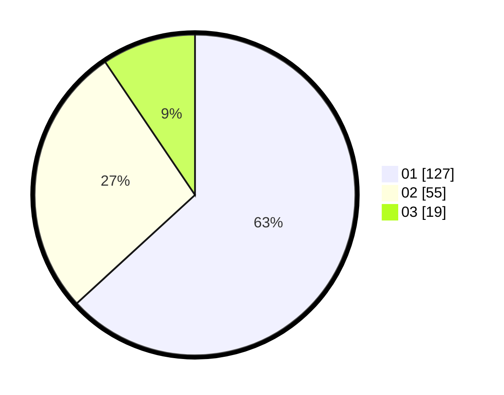

# Hasil

Hasil perolehan suara paslon dapat dilihat pada file paslon-01.txt, paslon-02.txt, dan paslon-03.txt.

Jika tidak ada, artinya data tersebut belum ada pada SIREKAP.

## Perolehan Suara

 * Paslon 01: **127**.
 * Paslon 02: **55**.
 * Paslon 03: **19**.

## Foto C Plano

https://sirekap-obj-formc.kpu.go.id/6e00/pemilu/ppwp/31/74/06/10/01/3174061001001-20240214-223319--4e01ec92-02cf-4648-92a7-bbeadce98337.jpg

https://sirekap-obj-formc.kpu.go.id/6e00/pemilu/ppwp/31/74/06/10/01/3174061001001-20240214-223547--67a37d30-7728-46c5-b939-41f3dfee925d.jpg

https://sirekap-obj-formc.kpu.go.id/6e00/pemilu/ppwp/31/74/06/10/01/3174061001001-20240214-223615--5ec8826e-d47d-440f-a206-e1040219e834.jpg

## DATA PEMILIH TETAP

Jumlah pemilih dalam DPT: **262**.
 * L: **134**.
 * P: **128**.

## DATA PENGGUNA HAK PILIH

Jumlah pengguna hak pilih dalam DPT: **189**.
 * L: **97**.
 * P: **92**.

Jumlah pengguna hak pilih dalam DPTb: **15**.
 * L: **4**.
 * P: **11**.

Jumlah pengguna hak pilih dalam DPK: **3**.
 * L: **2**.
 * P: **1**.

Jumlah pengguna hak pilih: **207**.
 * L: **103**.
 * P: **104**.

## JUMLAH SUARA SAH DAN TIDAK SAH

JUMLAH SELURUH SUARA SAH: **201**.

JUMLAH SUARA TIDAK SAH: **6**.

JUMLAH SELURUH SUARA SAH DAN SUARA TIDAK SAH: **207**.
