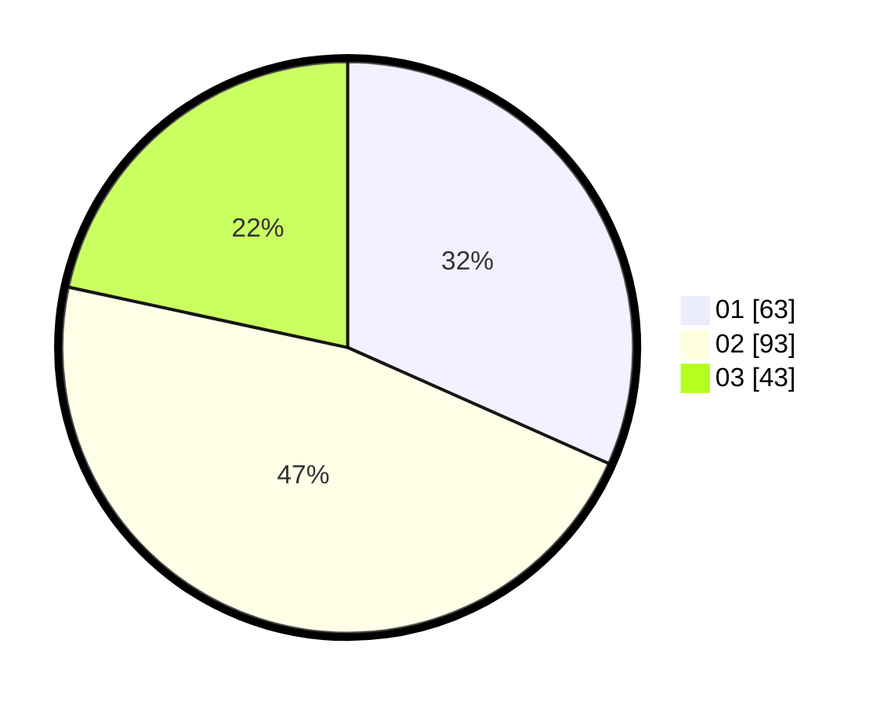

# Hasil

Hasil perolehan suara paslon dapat dilihat pada file paslon-01.txt, paslon-02.txt, dan paslon-03.txt.

Jika tidak ada, artinya data tersebut belum ada pada SIREKAP.

## Perolehan Suara

 * Paslon 01: **63**.
 * Paslon 02: **93**.
 * Paslon 03: **43**.

## Foto C Plano

https://sirekap-obj-formc.kpu.go.id/0661/pemilu/ppwp/31/74/06/10/01/3174061001009-20240216-163718--0ce48040-6006-46cb-9c63-6d8ebdf6f692.jpg

https://sirekap-obj-formc.kpu.go.id/0661/pemilu/ppwp/31/74/06/10/01/3174061001009-20240216-163926--7eb1a184-3ebf-4c6f-b4cb-b44f2b584323.jpg

https://sirekap-obj-formc.kpu.go.id/0661/pemilu/ppwp/31/74/06/10/01/3174061001009-20240216-164048--d48a9538-66a2-4ffb-b3b4-c891eaaa797a.jpg
