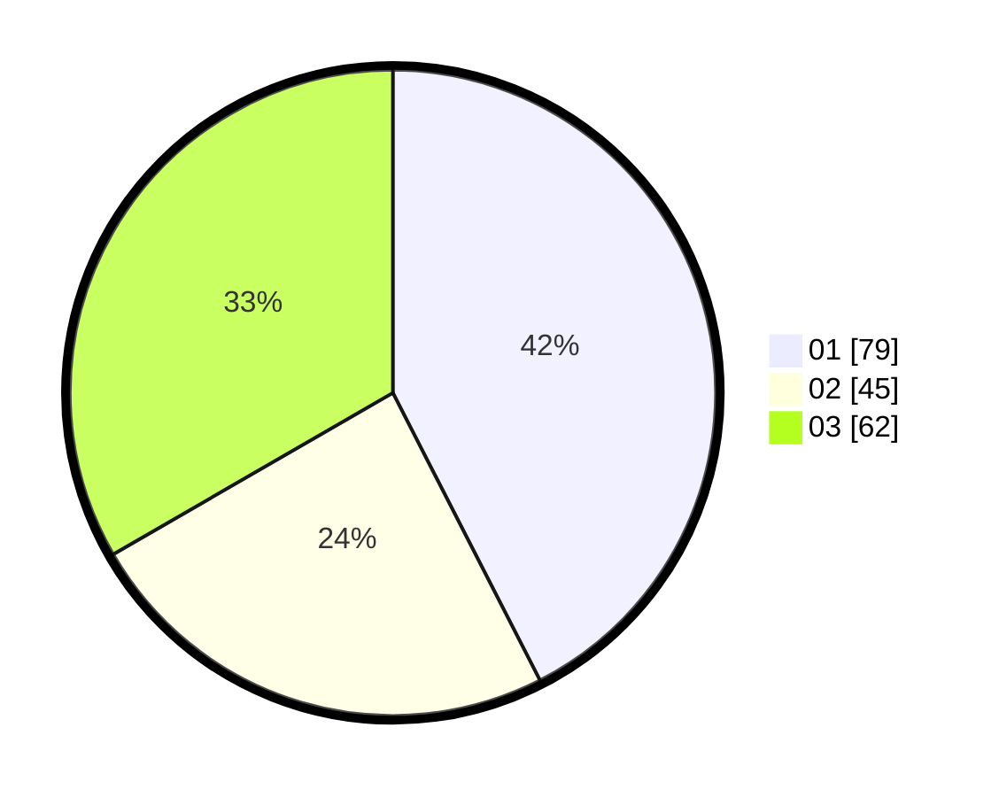

# Hasil

Hasil perolehan suara paslon dapat dilihat pada file paslon-01.txt, paslon-02.txt, dan paslon-03.txt.

Jika tidak ada, artinya data tersebut belum ada pada SIREKAP.

## Perolehan Suara

 * Paslon 01: **79**.
 * Paslon 02: **45**.
 * Paslon 03: **62**.

## Foto C Plano

https://sirekap-obj-formc.kpu.go.id/edda/pemilu/ppwp/31/74/06/10/01/3174061001011-20240214-155900--e674106d-6411-484d-a87c-435dc1792be3.jpg

https://sirekap-obj-formc.kpu.go.id/edda/pemilu/ppwp/31/74/06/10/01/3174061001011-20240214-155152--015f1dca-22da-464c-8e13-a9c23f3d2c57.jpg

https://sirekap-obj-formc.kpu.go.id/edda/pemilu/ppwp/31/74/06/10/01/3174061001011-20240214-155231--5ba0e466-daba-4fb3-a45b-ffc33bc72889.jpg

## DATA PEMILIH TETAP

Jumlah pemilih dalam DPT: **211**.
 * L: **90**.
 * P: **121**.

## DATA PENGGUNA HAK PILIH

Jumlah pengguna hak pilih dalam DPT: **179**.
 * L: **78**.
 * P: **101**.

Jumlah pengguna hak pilih dalam DPTb: **8**.
 * L: **4**.
 * P: **4**.

Jumlah pengguna hak pilih dalam DPK: **2**.
 * L: **1**.
 * P: **1**.

Jumlah pengguna hak pilih: **189**.
 * L: **83**.
 * P: **106**.

## JUMLAH SUARA SAH DAN TIDAK SAH

JUMLAH SELURUH SUARA SAH: **186**.

JUMLAH SUARA TIDAK SAH: **3**.

JUMLAH SELURUH SUARA SAH DAN SUARA TIDAK SAH: **189**.
