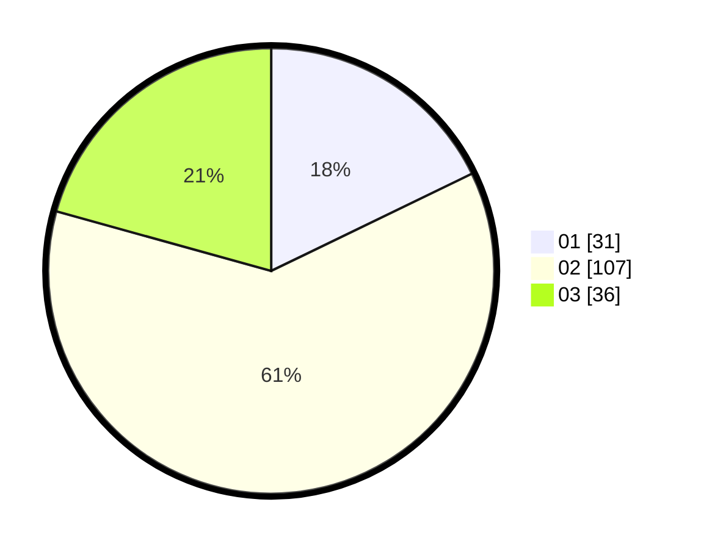

# Hasil

Hasil perolehan suara paslon dapat dilihat pada file paslon-01.txt, paslon-02.txt, dan paslon-03.txt.

Jika tidak ada, artinya data tersebut belum ada pada SIREKAP.

## Perolehan Suara

 * Paslon 01: **31**.
 * Paslon 02: **107**.
 * Paslon 03: **36**.

## Foto C Plano

https://sirekap-obj-formc.kpu.go.id/dd40/pemilu/ppwp/31/74/06/10/01/3174061001014-20240214-193203--05a9bd19-add8-4c3a-a3d7-d79e1c0cd686.jpg

https://sirekap-obj-formc.kpu.go.id/dd40/pemilu/ppwp/31/74/06/10/01/3174061001014-20240214-193304--7a81fe7c-ea97-49ad-8733-efcdef606483.jpg

https://sirekap-obj-formc.kpu.go.id/dd40/pemilu/ppwp/31/74/06/10/01/3174061001014-20240214-193339--8c16e235-232b-4327-945c-fc6f774e21c7.jpg
