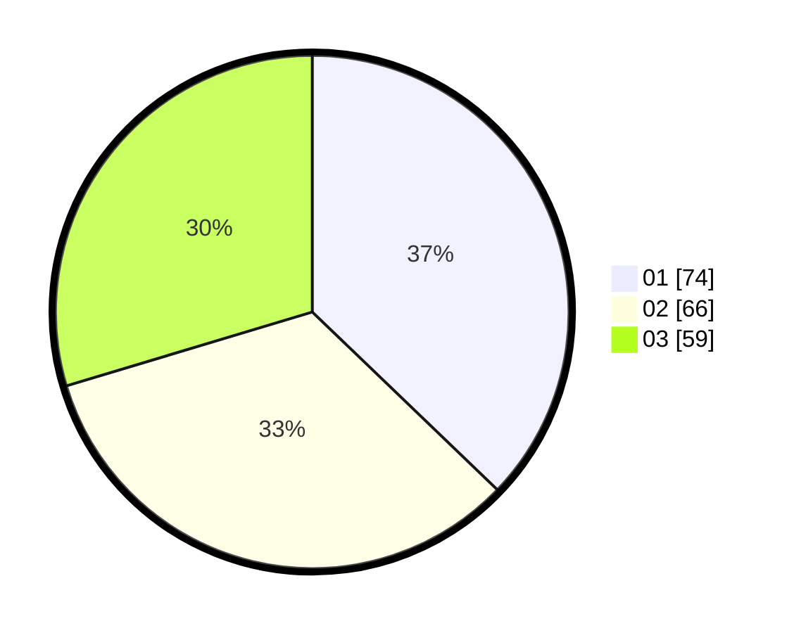

# Hasil

Hasil perolehan suara paslon dapat dilihat pada file paslon-01.txt, paslon-02.txt, dan paslon-03.txt.

Jika tidak ada, artinya data tersebut belum ada pada SIREKAP.

## Perolehan Suara

 * Paslon 01: **74**.
 * Paslon 02: **66**.
 * Paslon 03: **59**.

## Foto C Plano

https://sirekap-obj-formc.kpu.go.id/c102/pemilu/ppwp/31/74/06/10/01/3174061001018-20240214-232308--30ee0a73-a344-4ea5-9085-0dfe5c1afe0c.jpg

https://sirekap-obj-formc.kpu.go.id/c102/pemilu/ppwp/31/74/06/10/01/3174061001018-20240214-232803--03ac25e7-fd4f-4173-9c5a-20ae3b9e636d.jpg

https://sirekap-obj-formc.kpu.go.id/c102/pemilu/ppwp/31/74/06/10/01/3174061001018-20240214-195343--5b8dad95-26f8-469e-aa0d-e991f5db1092.jpg
