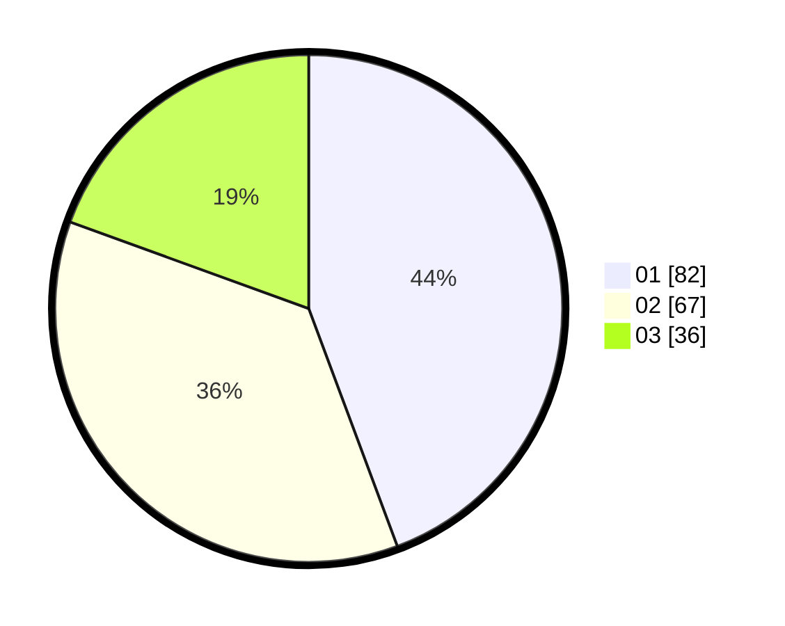

# Hasil

Hasil perolehan suara paslon dapat dilihat pada file paslon-01.txt, paslon-02.txt, dan paslon-03.txt.

Jika tidak ada, artinya data tersebut belum ada pada SIREKAP.

## Perolehan Suara

 * Paslon 01: **82**.
 * Paslon 02: **67**.
 * Paslon 03: **36**.

## Foto C Plano

https://sirekap-obj-formc.kpu.go.id/6fb4/pemilu/ppwp/31/74/06/10/01/3174061001019-20240214-190539--803acd8a-fdd4-4181-83c0-3c0ae53a1501.jpg

https://sirekap-obj-formc.kpu.go.id/6fb4/pemilu/ppwp/31/74/06/10/01/3174061001019-20240214-193437--4c4223ba-097d-459a-8e19-d6149bfc63f5.jpg

https://sirekap-obj-formc.kpu.go.id/6fb4/pemilu/ppwp/31/74/06/10/01/3174061001019-20240214-190548--94895d4c-03e9-4a34-ab75-03315df4bd47.jpg

## DATA PEMILIH TETAP

Jumlah pemilih dalam DPT: **237**.
 * L: **116**.
 * P: **121**.

## DATA PENGGUNA HAK PILIH

Jumlah pengguna hak pilih dalam DPT: **181**.
 * L: **83**.
 * P: **98**.

Jumlah pengguna hak pilih dalam DPTb: **6**.
 * L: **3**.
 * P: **3**.

Jumlah pengguna hak pilih dalam DPK: **2**.
 * L: **1**.
 * P: **1**.

Jumlah pengguna hak pilih: **189**.
 * L: **87**.
 * P: **102**.

## JUMLAH SUARA SAH DAN TIDAK SAH

JUMLAH SELURUH SUARA SAH: **185**.

JUMLAH SUARA TIDAK SAH: **4**.

JUMLAH SELURUH SUARA SAH DAN SUARA TIDAK SAH: **189**.
