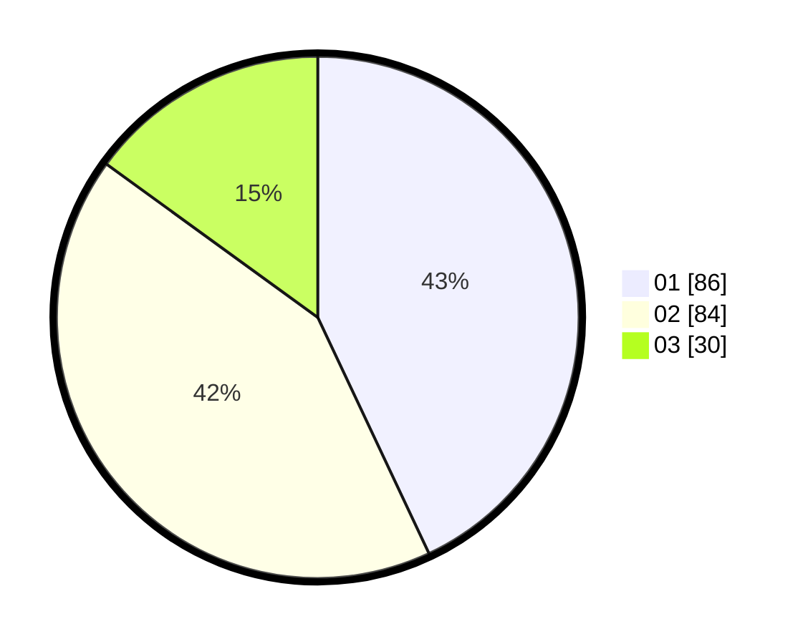

# Hasil

Hasil perolehan suara paslon dapat dilihat pada file paslon-01.txt, paslon-02.txt, dan paslon-03.txt.

Jika tidak ada, artinya data tersebut belum ada pada SIREKAP.

## Perolehan Suara

 * Paslon 01: **86**.
 * Paslon 02: **84**.
 * Paslon 03: **30**.

## Foto C Plano

https://sirekap-obj-formc.kpu.go.id/571e/pemilu/ppwp/31/74/06/10/01/3174061001020-20240215-015552--6d3cc610-9a14-44ee-b86d-d5d78943bbc9.jpg

https://sirekap-obj-formc.kpu.go.id/571e/pemilu/ppwp/31/74/06/10/01/3174061001020-20240215-015742--1d77a2b7-805e-4099-ae81-02fab7b0ee82.jpg

https://sirekap-obj-formc.kpu.go.id/571e/pemilu/ppwp/31/74/06/10/01/3174061001020-20240215-015954--394acc63-115c-4b5e-8689-2cc8d3fb8e21.jpg
