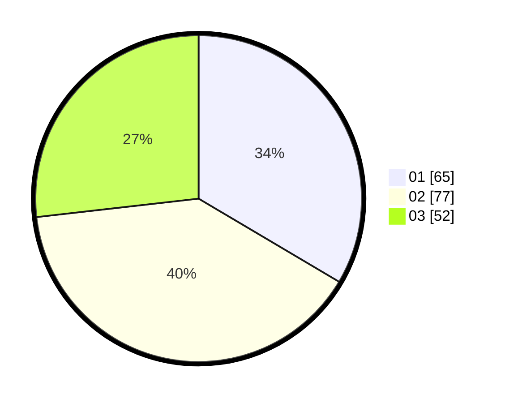

# Hasil

Hasil perolehan suara paslon dapat dilihat pada file paslon-01.txt, paslon-02.txt, dan paslon-03.txt.

Jika tidak ada, artinya data tersebut belum ada pada SIREKAP.

## Perolehan Suara

 * Paslon 01: **65**.
 * Paslon 02: **77**.
 * Paslon 03: **52**.

## Foto C Plano

https://sirekap-obj-formc.kpu.go.id/0a5e/pemilu/ppwp/31/74/06/10/01/3174061001022-20240214-155929--dbab5ef7-0501-4229-8d3d-07aebe60c294.jpg

https://sirekap-obj-formc.kpu.go.id/0a5e/pemilu/ppwp/31/74/06/10/01/3174061001022-20240214-155252--501df7ea-3ba4-46e3-9c49-764c4978fb65.jpg

https://sirekap-obj-formc.kpu.go.id/0a5e/pemilu/ppwp/31/74/06/10/01/3174061001022-20240214-155546--629cef25-b84f-43de-8e70-454dd1f6bea2.jpg
