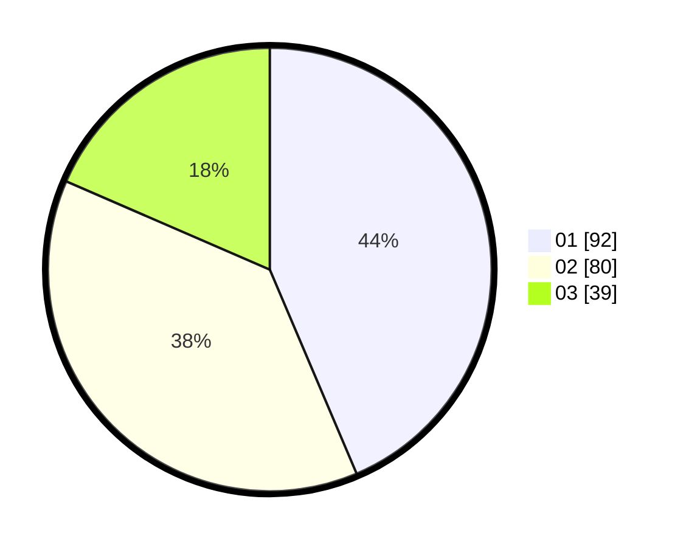

# Hasil

Hasil perolehan suara paslon dapat dilihat pada file paslon-01.txt, paslon-02.txt, dan paslon-03.txt.

Jika tidak ada, artinya data tersebut belum ada pada SIREKAP.

## Perolehan Suara

 * Paslon 01: **92**.
 * Paslon 02: **80**.
 * Paslon 03: **39**.

## Foto C Plano

https://sirekap-obj-formc.kpu.go.id/ab27/pemilu/ppwp/31/74/06/10/01/3174061001026-20240215-005211--6a2bd3e4-aca3-4cfb-88b4-9f9ad38f9e87.jpg

https://sirekap-obj-formc.kpu.go.id/ab27/pemilu/ppwp/31/74/06/10/01/3174061001026-20240215-004955--1ace4d81-aa02-447c-89d4-532c8ecde41a.jpg

https://sirekap-obj-formc.kpu.go.id/ab27/pemilu/ppwp/31/74/06/10/01/3174061001026-20240215-005110--7679b4d6-1761-46b0-91ec-6a5f7cfa734e.jpg
