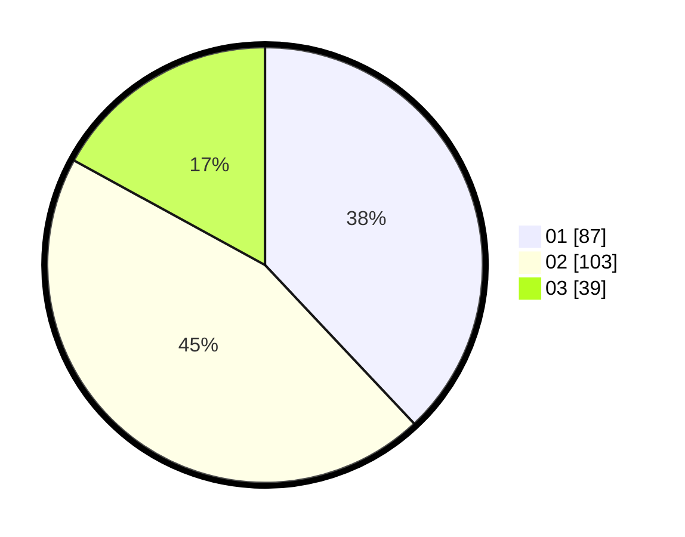

# Hasil

Hasil perolehan suara paslon dapat dilihat pada file paslon-01.txt, paslon-02.txt, dan paslon-03.txt.

Jika tidak ada, artinya data tersebut belum ada pada SIREKAP.

## Perolehan Suara

 * Paslon 01: **87**.
 * Paslon 02: **103**.
 * Paslon 03: **39**.

## Foto C Plano

https://sirekap-obj-formc.kpu.go.id/e229/pemilu/ppwp/31/74/06/10/01/3174061001028-20240216-174636--5b21971a-0fb6-466c-885c-b79a3a783995.jpg

https://sirekap-obj-formc.kpu.go.id/e229/pemilu/ppwp/31/74/06/10/01/3174061001028-20240216-174715--d85fe97e-f4fb-458c-9868-7687ea92cb12.jpg

https://sirekap-obj-formc.kpu.go.id/e229/pemilu/ppwp/31/74/06/10/01/3174061001028-20240216-174755--ea10cf96-2a92-4959-af48-516e4fb0cbc3.jpg
