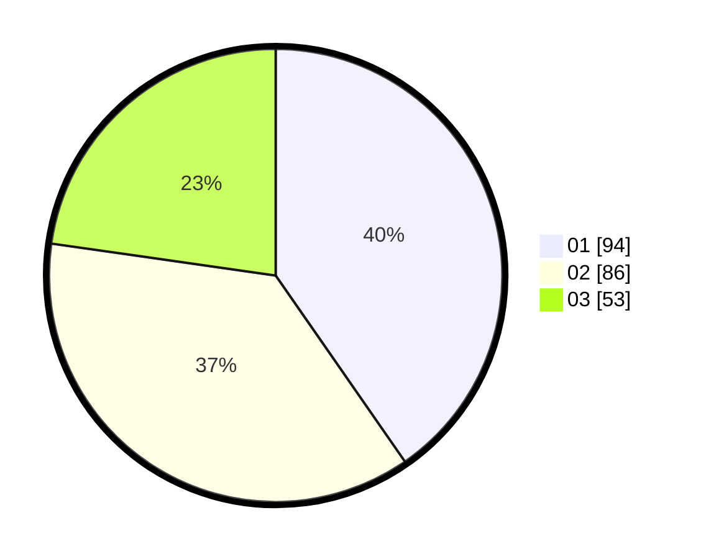

# Hasil

Hasil perolehan suara paslon dapat dilihat pada file paslon-01.txt, paslon-02.txt, dan paslon-03.txt.

Jika tidak ada, artinya data tersebut belum ada pada SIREKAP.

## Perolehan Suara

 * Paslon 01: **94**.
 * Paslon 02: **86**.
 * Paslon 03: **53**.

## Foto C Plano

https://sirekap-obj-formc.kpu.go.id/9a10/pemilu/ppwp/31/74/06/10/01/3174061001030-20240216-175150--3501bae7-05a8-4ab3-8c92-12d955e8883c.jpg

https://sirekap-obj-formc.kpu.go.id/9a10/pemilu/ppwp/31/74/06/10/01/3174061001030-20240216-175239--8902895a-3351-407f-8bef-5573788d7c3d.jpg

https://sirekap-obj-formc.kpu.go.id/9a10/pemilu/ppwp/31/74/06/10/01/3174061001030-20240216-175307--dd5231c6-aee5-4b8f-bce0-7c0e3db422a1.jpg
