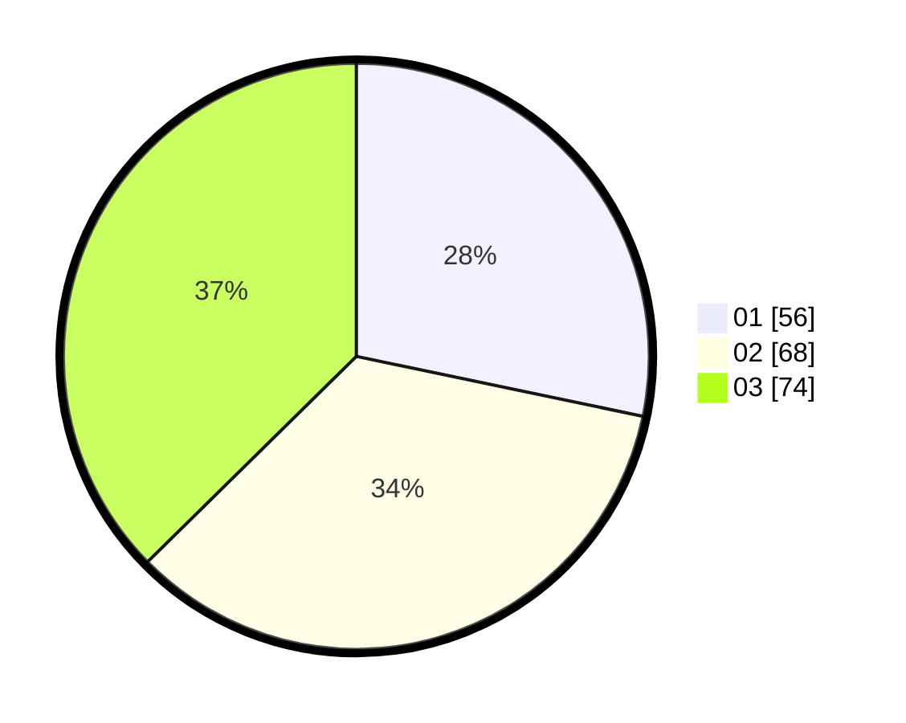

# Hasil

Hasil perolehan suara paslon dapat dilihat pada file paslon-01.txt, paslon-02.txt, dan paslon-03.txt.

Jika tidak ada, artinya data tersebut belum ada pada SIREKAP.

## Perolehan Suara

 * Paslon 01: **56**.
 * Paslon 02: **68**.
 * Paslon 03: **74**.

## Foto C Plano

https://sirekap-obj-formc.kpu.go.id/7669/pemilu/ppwp/31/74/06/10/01/3174061001032-20240214-222341--d0d86d69-f227-4373-92ca-3aaefe30528c.jpg

https://sirekap-obj-formc.kpu.go.id/7669/pemilu/ppwp/31/74/06/10/01/3174061001032-20240218-235923--958d7481-8851-44bb-94ee-0287817b8537.jpg

https://sirekap-obj-formc.kpu.go.id/7669/pemilu/ppwp/31/74/06/10/01/3174061001032-20240214-222832--0f4cd9ea-0b03-408c-af00-186ba2f31c5e.jpg

## DATA PEMILIH TETAP

Jumlah pemilih dalam DPT: **221**.
 * L: **108**.
 * P: **113**.

## DATA PENGGUNA HAK PILIH

Jumlah pengguna hak pilih dalam DPT: **191**.
 * L: **95**.
 * P: **96**.

Jumlah pengguna hak pilih dalam DPTb: **10**.
 * L: **5**.
 * P: **5**.

Jumlah pengguna hak pilih dalam DPK: **1**.
 * L: **0**.
 * P: **1**.

Jumlah pengguna hak pilih: **202**.
 * L: **100**.
 * P: **102**.

## JUMLAH SUARA SAH DAN TIDAK SAH

JUMLAH SELURUH SUARA SAH: **198**.

JUMLAH SUARA TIDAK SAH: **4**.

JUMLAH SELURUH SUARA SAH DAN SUARA TIDAK SAH: **202**.
