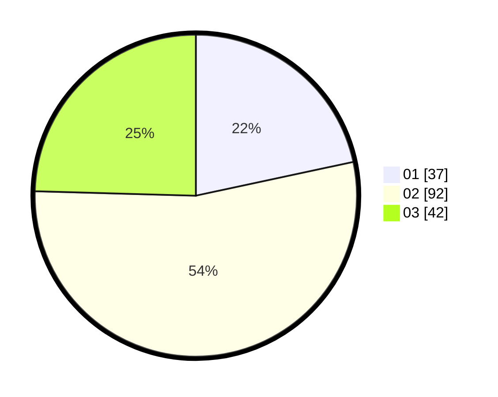

# Hasil

Hasil perolehan suara paslon dapat dilihat pada file paslon-01.txt, paslon-02.txt, dan paslon-03.txt.

Jika tidak ada, artinya data tersebut belum ada pada SIREKAP.

## Perolehan Suara

 * Paslon 01: **37**.
 * Paslon 02: **92**.
 * Paslon 03: **42**.

## Foto C Plano

https://sirekap-obj-formc.kpu.go.id/435a/pemilu/ppwp/31/74/06/10/01/3174061001040-20240216-005938--120f2c40-84c8-41be-9319-9268741f299d.jpg

https://sirekap-obj-formc.kpu.go.id/435a/pemilu/ppwp/31/74/06/10/01/3174061001040-20240216-005940--5d022cb4-d530-49b9-8b3c-c2d0cf1ae8ff.jpg

https://sirekap-obj-formc.kpu.go.id/435a/pemilu/ppwp/31/74/06/10/01/3174061001040-20240216-005939--46efb604-4bf4-4098-b1c1-05434a27ac2e.jpg

## DATA PEMILIH TETAP

Jumlah pemilih dalam DPT: **217**.
 * L: **112**.
 * P: **105**.

## DATA PENGGUNA HAK PILIH

Jumlah pengguna hak pilih dalam DPT: **171**.
 * L: **82**.
 * P: **89**.

Jumlah pengguna hak pilih dalam DPTb: **0**.
 * L: **0**.
 * P: **0**.

Jumlah pengguna hak pilih dalam DPK: **3**.
 * L: **2**.
 * P: **1**.

Jumlah pengguna hak pilih: **174**.
 * L: **84**.
 * P: **90**.

## JUMLAH SUARA SAH DAN TIDAK SAH

JUMLAH SELURUH SUARA SAH: **171**.

JUMLAH SUARA TIDAK SAH: **3**.

JUMLAH SELURUH SUARA SAH DAN SUARA TIDAK SAH: **174**.
