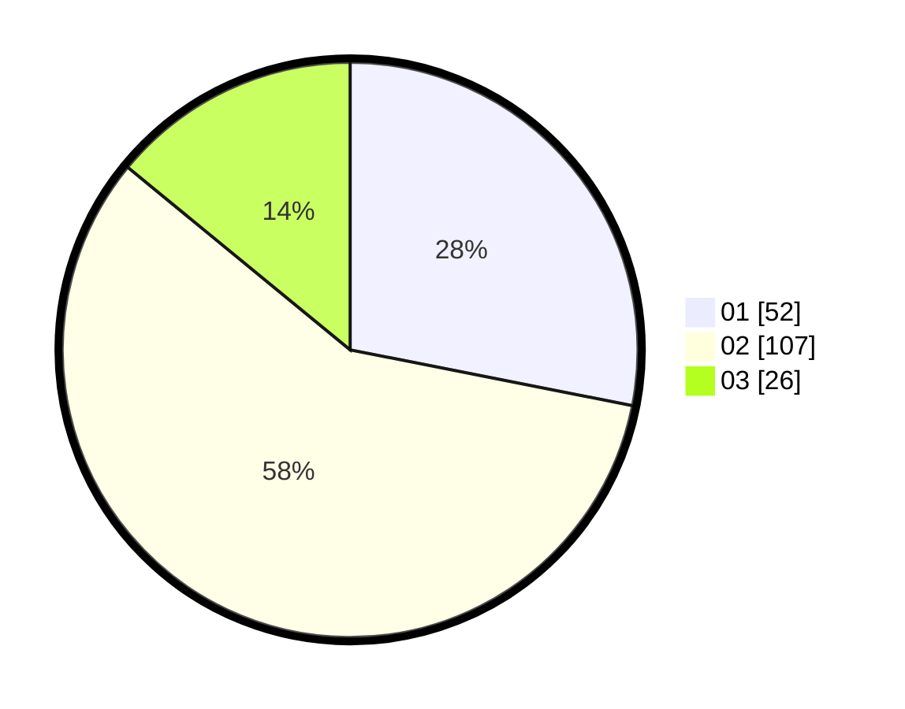

# Hasil

Hasil perolehan suara paslon dapat dilihat pada file paslon-01.txt, paslon-02.txt, dan paslon-03.txt.

Jika tidak ada, artinya data tersebut belum ada pada SIREKAP.

## Perolehan Suara

 * Paslon 01: **52**.
 * Paslon 02: **107**.
 * Paslon 03: **26**.

## Foto C Plano

https://sirekap-obj-formc.kpu.go.id/ea4a/pemilu/ppwp/31/74/06/10/01/3174061001041-20240215-221739--b4a3085d-59b4-4425-bfcd-08baab9a8b6d.jpg

https://sirekap-obj-formc.kpu.go.id/ea4a/pemilu/ppwp/31/74/06/10/01/3174061001041-20240215-221741--bda613e3-fa7a-479b-8dc1-87e02b37dfc0.jpg

https://sirekap-obj-formc.kpu.go.id/ea4a/pemilu/ppwp/31/74/06/10/01/3174061001041-20240215-221740--6f1b4223-ef2d-431c-916e-4c7265f67497.jpg

## DATA PEMILIH TETAP

Jumlah pemilih dalam DPT: **183**.
 * L: **92**.
 * P: **91**.

## DATA PENGGUNA HAK PILIH

Jumlah pengguna hak pilih dalam DPT: **183**.
 * L: **92**.
 * P: **91**.

Jumlah pengguna hak pilih dalam DPTb: **0**.
 * L: **0**.
 * P: **0**.

Jumlah pengguna hak pilih dalam DPK: **3**.
 * L: **2**.
 * P: **1**.

Jumlah pengguna hak pilih: **186**.
 * L: **94**.
 * P: **92**.

## JUMLAH SUARA SAH DAN TIDAK SAH

JUMLAH SELURUH SUARA SAH: **185**.

JUMLAH SUARA TIDAK SAH: **1**.

JUMLAH SELURUH SUARA SAH DAN SUARA TIDAK SAH: **186**.
