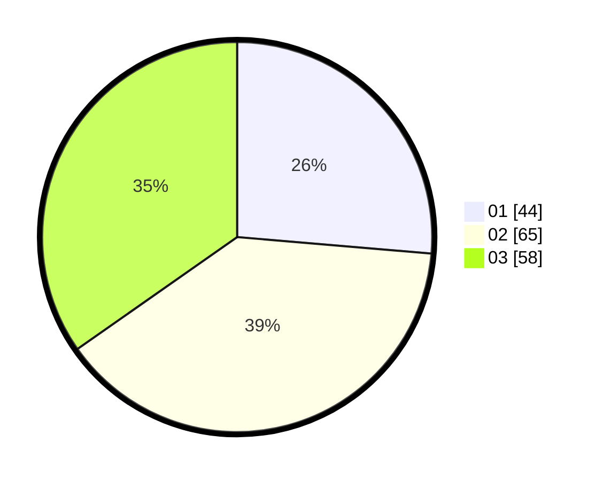

# Hasil

Hasil perolehan suara paslon dapat dilihat pada file paslon-01.txt, paslon-02.txt, dan paslon-03.txt.

Jika tidak ada, artinya data tersebut belum ada pada SIREKAP.

## Perolehan Suara

 * Paslon 01: **44**.
 * Paslon 02: **65**.
 * Paslon 03: **58**.

## Foto C Plano

https://sirekap-obj-formc.kpu.go.id/f9c0/pemilu/ppwp/31/74/06/10/01/3174061001050-20240215-184352--2eac2121-a7a6-411b-ad53-da35d07dab22.jpg

https://sirekap-obj-formc.kpu.go.id/f9c0/pemilu/ppwp/31/74/06/10/01/3174061001050-20240215-184518--d9928f64-0b14-44a1-bd28-4aae1ada2911.jpg

https://sirekap-obj-formc.kpu.go.id/f9c0/pemilu/ppwp/31/74/06/10/01/3174061001050-20240215-184737--cd4ede0e-333b-4cb7-bd30-199a13ddb218.jpg
