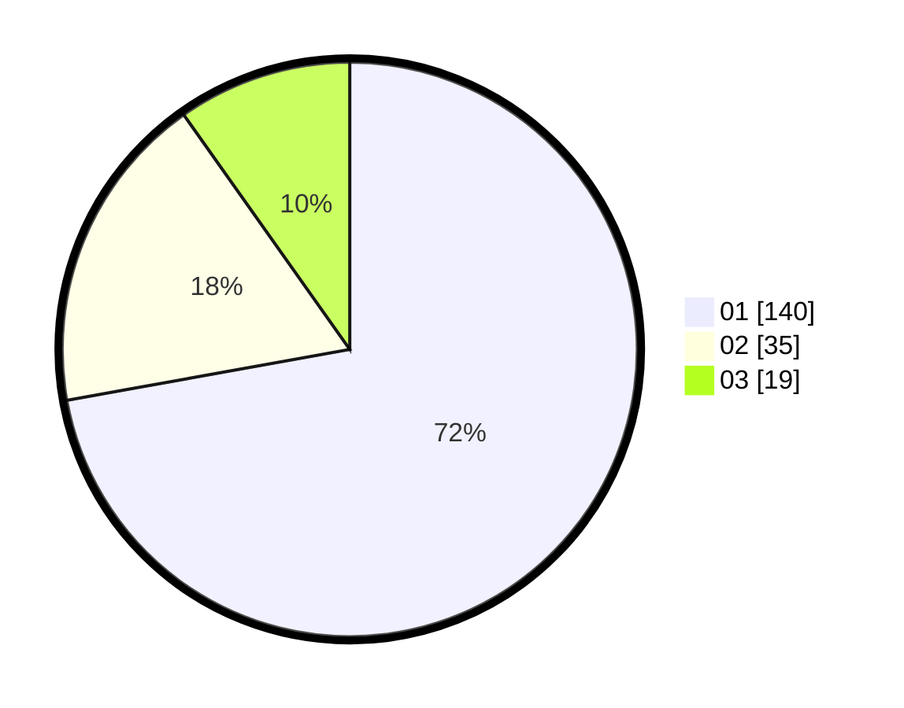

# Hasil

Hasil perolehan suara paslon dapat dilihat pada file paslon-01.txt, paslon-02.txt, dan paslon-03.txt.

Jika tidak ada, artinya data tersebut belum ada pada SIREKAP.

## Perolehan Suara

 * Paslon 01: **140**.
 * Paslon 02: **35**.
 * Paslon 03: **19**.

## Foto C Plano

https://sirekap-obj-formc.kpu.go.id/97c7/pemilu/ppwp/31/74/06/10/01/3174061001060-20240215-175647--fedf9595-40a1-470c-a315-3cce235e8508.jpg

https://sirekap-obj-formc.kpu.go.id/97c7/pemilu/ppwp/31/74/06/10/01/3174061001060-20240215-175816--850be917-ffb1-4d06-85c7-cd355a8688f8.jpg

https://sirekap-obj-formc.kpu.go.id/97c7/pemilu/ppwp/31/74/06/10/01/3174061001060-20240215-175925--7da9e885-fdfe-439d-aa6e-88690be634df.jpg
