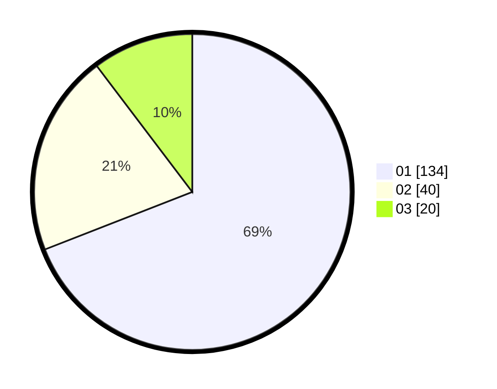

# Hasil

Hasil perolehan suara paslon dapat dilihat pada file paslon-01.txt, paslon-02.txt, dan paslon-03.txt.

Jika tidak ada, artinya data tersebut belum ada pada SIREKAP.

## Perolehan Suara

 * Paslon 01: **134**.
 * Paslon 02: **40**.
 * Paslon 03: **20**.

## Foto C Plano

https://sirekap-obj-formc.kpu.go.id/07d3/pemilu/ppwp/31/74/06/10/01/3174061001061-20240214-192240--a542a79c-40b1-4d1e-88d3-6484fd25e2fe.jpg

https://sirekap-obj-formc.kpu.go.id/07d3/pemilu/ppwp/31/74/06/10/01/3174061001061-20240214-211719--a08cd431-001c-4037-877e-088d1f12298e.jpg

https://sirekap-obj-formc.kpu.go.id/07d3/pemilu/ppwp/31/74/06/10/01/3174061001061-20240214-211750--536add43-30d7-48ff-b71f-bc66e43f50e0.jpg

## DATA PEMILIH TETAP

Jumlah pemilih dalam DPT: **221**.
 * L: **112**.
 * P: **109**.

## DATA PENGGUNA HAK PILIH

Jumlah pengguna hak pilih dalam DPT: **178**.
 * L: **86**.
 * P: **92**.

Jumlah pengguna hak pilih dalam DPTb: **18**.
 * L: **6**.
 * P: **12**.

Jumlah pengguna hak pilih dalam DPK: **1**.
 * L: **0**.
 * P: **1**.

Jumlah pengguna hak pilih: **197**.
 * L: **92**.
 * P: **105**.

## JUMLAH SUARA SAH DAN TIDAK SAH

JUMLAH SELURUH SUARA SAH: **194**.

JUMLAH SUARA TIDAK SAH: **3**.

JUMLAH SELURUH SUARA SAH DAN SUARA TIDAK SAH: **197**.
