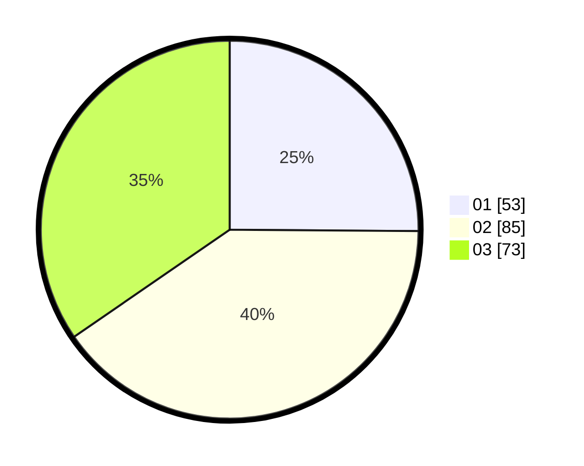

# Hasil

Hasil perolehan suara paslon dapat dilihat pada file paslon-01.txt, paslon-02.txt, dan paslon-03.txt.

Jika tidak ada, artinya data tersebut belum ada pada SIREKAP.

## Perolehan Suara

 * Paslon 01: **53**.
 * Paslon 02: **85**.
 * Paslon 03: **73**.

## Foto C Plano

https://sirekap-obj-formc.kpu.go.id/0877/pemilu/ppwp/31/74/06/10/01/3174061001145-20240214-185637--2703a19e-34a5-4df5-862e-b2cb34d3718c.jpg

https://sirekap-obj-formc.kpu.go.id/0877/pemilu/ppwp/31/74/06/10/01/3174061001145-20240214-184506--04c965ae-619d-429d-9192-c4242eb61500.jpg

https://sirekap-obj-formc.kpu.go.id/0877/pemilu/ppwp/31/74/06/10/01/3174061001145-20240214-193458--ca019780-42fc-4df6-9d15-ffca625655ea.jpg

## DATA PEMILIH TETAP

Jumlah pemilih dalam DPT: **276**.
 * L: **129**.
 * P: **147**.

## DATA PENGGUNA HAK PILIH

Jumlah pengguna hak pilih dalam DPT: **201**.
 * L: **94**.
 * P: **107**.

Jumlah pengguna hak pilih dalam DPTb: **3**.
 * L: **1**.
 * P: **2**.

Jumlah pengguna hak pilih dalam DPK: **12**.
 * L: **6**.
 * P: **6**.

Jumlah pengguna hak pilih: **216**.
 * L: **101**.
 * P: **115**.

## JUMLAH SUARA SAH DAN TIDAK SAH

JUMLAH SELURUH SUARA SAH: **211**.

JUMLAH SUARA TIDAK SAH: **5**.

JUMLAH SELURUH SUARA SAH DAN SUARA TIDAK SAH: **216**.
