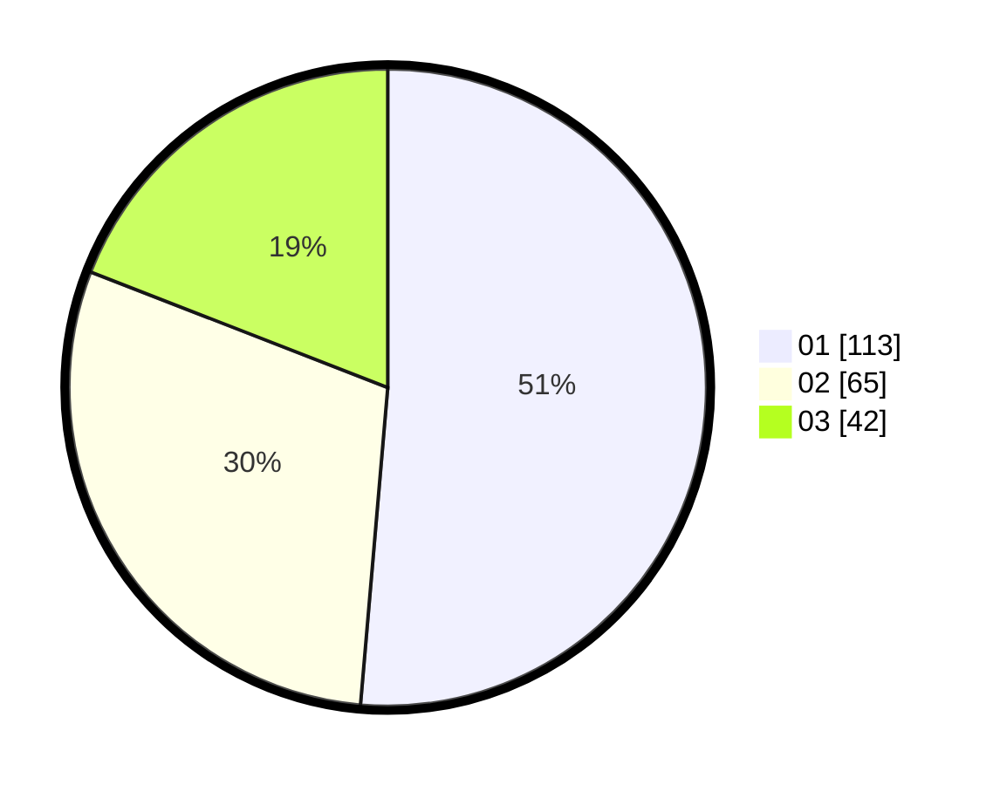

# Hasil

Hasil perolehan suara paslon dapat dilihat pada file paslon-01.txt, paslon-02.txt, dan paslon-03.txt.

Jika tidak ada, artinya data tersebut belum ada pada SIREKAP.

## Perolehan Suara

 * Paslon 01: **113**.
 * Paslon 02: **65**.
 * Paslon 03: **42**.

## Foto C Plano

https://sirekap-obj-formc.kpu.go.id/3a06/pemilu/ppwp/31/74/06/10/01/3174061001154-20240216-121136--e242738d-dfb7-43b0-9f5a-607983dc7c95.jpg

https://sirekap-obj-formc.kpu.go.id/3a06/pemilu/ppwp/31/74/06/10/01/3174061001154-20240216-121246--3ebd5672-ffd4-4cf3-9a09-6e74589970c4.jpg

https://sirekap-obj-formc.kpu.go.id/3a06/pemilu/ppwp/31/74/06/10/01/3174061001154-20240216-122054--06901fe9-db26-4afc-a8ae-14bbe26cba32.jpg

## DATA PEMILIH TETAP

Jumlah pemilih dalam DPT: **222**.
 * L: **446**.
 * P: **846**.

## DATA PENGGUNA HAK PILIH

Jumlah pengguna hak pilih dalam DPT: **225**.
 * L: **2**.
 * P: **409**.

Jumlah pengguna hak pilih dalam DPTb: **606**.
 * L: **2**.
 * P: **2**.

Jumlah pengguna hak pilih dalam DPK: **63**.
 * L: **3**.
 * P: **0**.

Jumlah pengguna hak pilih: **228**.
 * L: **867**.
 * P: **623**.

## JUMLAH SUARA SAH DAN TIDAK SAH

JUMLAH SELURUH SUARA SAH: **220**.

JUMLAH SUARA TIDAK SAH: **8**.

JUMLAH SELURUH SUARA SAH DAN SUARA TIDAK SAH: **228**.
