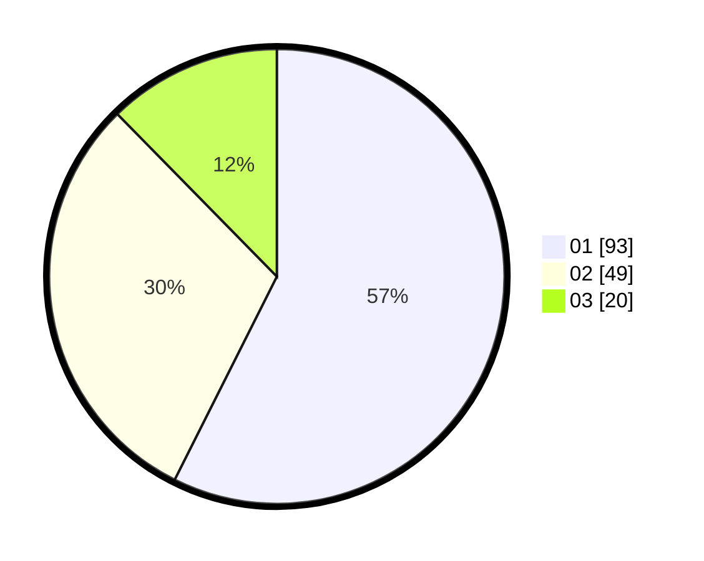

# Hasil

Hasil perolehan suara paslon dapat dilihat pada file paslon-01.txt, paslon-02.txt, dan paslon-03.txt.

Jika tidak ada, artinya data tersebut belum ada pada SIREKAP.

## Perolehan Suara

 * Paslon 01: **93**.
 * Paslon 02: **49**.
 * Paslon 03: **20**.

## Foto C Plano

https://sirekap-obj-formc.kpu.go.id/0642/pemilu/ppwp/31/74/06/10/01/3174061001172-20240214-192859--317a98ba-8085-4c25-8820-44a6b1f92dbd.jpg

https://sirekap-obj-formc.kpu.go.id/0642/pemilu/ppwp/31/74/06/10/01/3174061001172-20240214-214628--4546287e-2989-4d72-9222-df2581d26141.jpg

https://sirekap-obj-formc.kpu.go.id/0642/pemilu/ppwp/31/74/06/10/01/3174061001172-20240214-193109--0ac398ce-0efa-45e4-a51d-8b1ede35da96.jpg

## DATA PEMILIH TETAP

Jumlah pemilih dalam DPT: **205**.
 * L: **97**.
 * P: **108**.

## DATA PENGGUNA HAK PILIH

Jumlah pengguna hak pilih dalam DPT: **163**.
 * L: **78**.
 * P: **85**.

Jumlah pengguna hak pilih dalam DPTb: **2**.
 * L: **2**.
 * P: **0**.

Jumlah pengguna hak pilih dalam DPK: **1**.
 * L: **1**.
 * P: **0**.

Jumlah pengguna hak pilih: **166**.
 * L: **81**.
 * P: **85**.

## JUMLAH SUARA SAH DAN TIDAK SAH

JUMLAH SELURUH SUARA SAH: **162**.

JUMLAH SUARA TIDAK SAH: **4**.

JUMLAH SELURUH SUARA SAH DAN SUARA TIDAK SAH: **166**.
