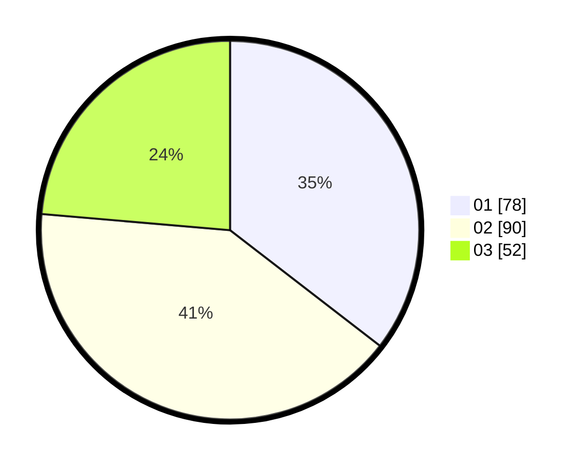

# Hasil

Hasil perolehan suara paslon dapat dilihat pada file paslon-01.txt, paslon-02.txt, dan paslon-03.txt.

Jika tidak ada, artinya data tersebut belum ada pada SIREKAP.

## Perolehan Suara

 * Paslon 01: **78**.
 * Paslon 02: **90**.
 * Paslon 03: **52**.

## Foto C Plano

https://sirekap-obj-formc.kpu.go.id/42e1/pemilu/ppwp/31/74/06/10/01/3174061001180-20240214-210604--d907aea8-0086-4e2f-9ee3-224505cd3cb6.jpg

https://sirekap-obj-formc.kpu.go.id/42e1/pemilu/ppwp/31/74/06/10/01/3174061001180-20240214-211100--dde7f660-069b-4add-be81-43fe0c3d534e.jpg

https://sirekap-obj-formc.kpu.go.id/42e1/pemilu/ppwp/31/74/06/10/01/3174061001180-20240214-211433--7b782f8e-9b8e-4c35-b85d-0f79c7de01d2.jpg

## DATA PEMILIH TETAP

Jumlah pemilih dalam DPT: **276**.
 * L: **128**.
 * P: **148**.

## DATA PENGGUNA HAK PILIH

Jumlah pengguna hak pilih dalam DPT: **211**.
 * L: **96**.
 * P: **115**.

Jumlah pengguna hak pilih dalam DPTb: **7**.
 * L: **4**.
 * P: **3**.

Jumlah pengguna hak pilih dalam DPK: **5**.
 * L: **3**.
 * P: **2**.

Jumlah pengguna hak pilih: **223**.
 * L: **103**.
 * P: **120**.

## JUMLAH SUARA SAH DAN TIDAK SAH

JUMLAH SELURUH SUARA SAH: **220**.

JUMLAH SUARA TIDAK SAH: **3**.

JUMLAH SELURUH SUARA SAH DAN SUARA TIDAK SAH: **223**.
