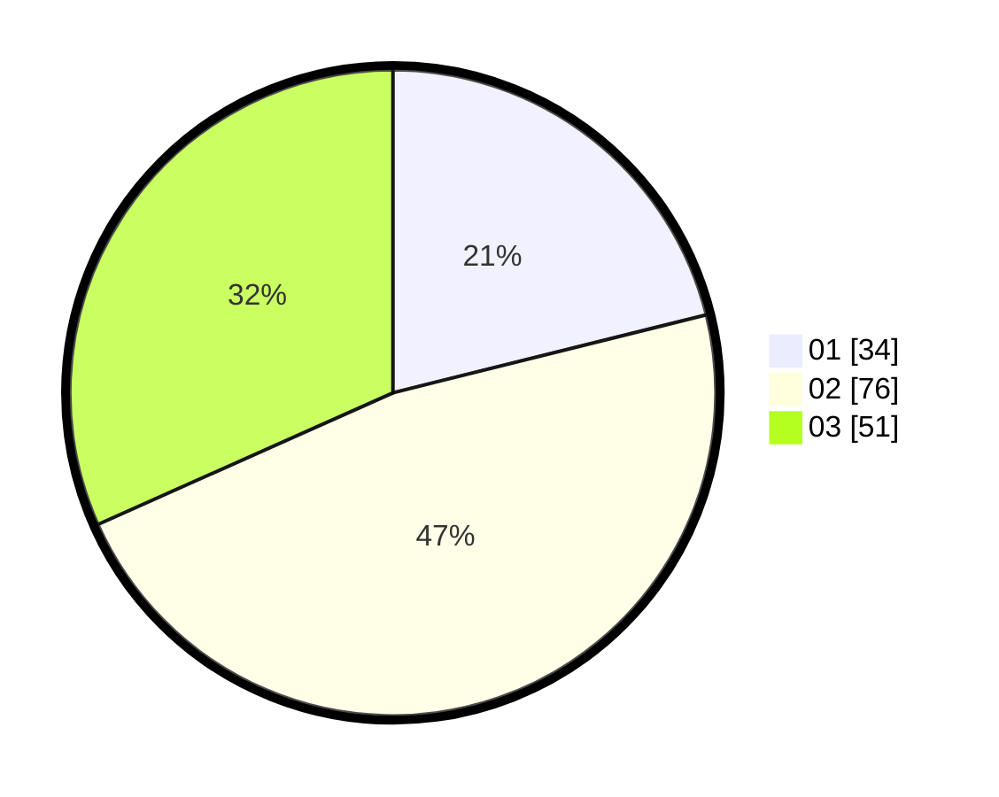

# Hasil

Hasil perolehan suara paslon dapat dilihat pada file paslon-01.txt, paslon-02.txt, dan paslon-03.txt.

Jika tidak ada, artinya data tersebut belum ada pada SIREKAP.

## Perolehan Suara

 * Paslon 01: **34**.
 * Paslon 02: **76**.
 * Paslon 03: **51**.

## Foto C Plano

https://sirekap-obj-formc.kpu.go.id/055f/pemilu/ppwp/31/74/06/10/01/3174061001181-20240216-182143--ffe731e2-d072-44b3-9702-142424ea88ca.jpg

https://sirekap-obj-formc.kpu.go.id/055f/pemilu/ppwp/31/74/06/10/01/3174061001181-20240216-194317--5beb2099-3789-4829-b17a-60b14fd4f022.jpg

https://sirekap-obj-formc.kpu.go.id/055f/pemilu/ppwp/31/74/06/10/01/3174061001181-20240216-162614--0dfc1539-213c-4064-be8b-f22a8e70ae23.jpg

## DATA PEMILIH TETAP

Jumlah pemilih dalam DPT: **213**.
 * L: **89**.
 * P: **124**.

## DATA PENGGUNA HAK PILIH

Jumlah pengguna hak pilih dalam DPT: **153**.
 * L: **66**.
 * P: **87**.

Jumlah pengguna hak pilih dalam DPTb: **5**.
 * L: **4**.
 * P: **1**.

Jumlah pengguna hak pilih dalam DPK: **6**.
 * L: **4**.
 * P: **2**.

Jumlah pengguna hak pilih: **164**.
 * L: **74**.
 * P: **90**.

## JUMLAH SUARA SAH DAN TIDAK SAH

JUMLAH SELURUH SUARA SAH: **153**.

JUMLAH SUARA TIDAK SAH: **7**.

JUMLAH SELURUH SUARA SAH DAN SUARA TIDAK SAH: **160**.
