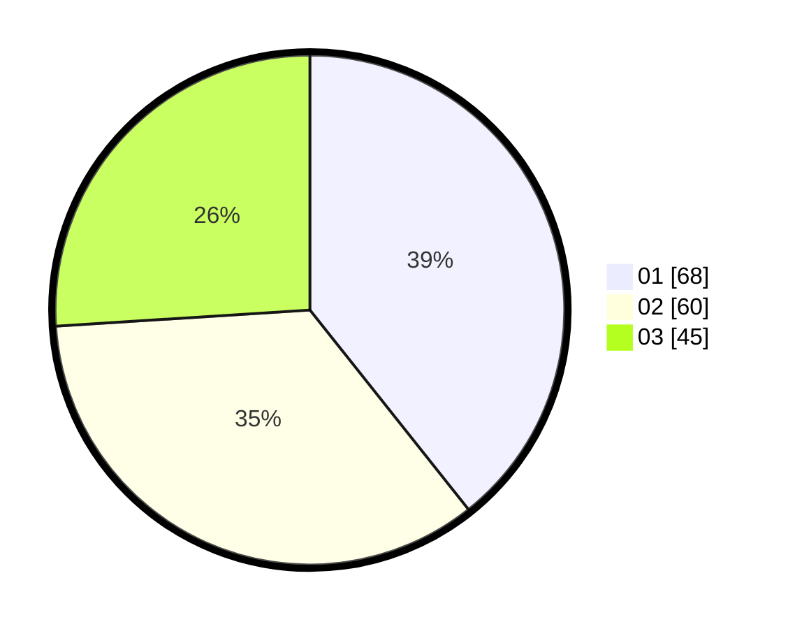

# Hasil

Hasil perolehan suara paslon dapat dilihat pada file paslon-01.txt, paslon-02.txt, dan paslon-03.txt.

Jika tidak ada, artinya data tersebut belum ada pada SIREKAP.

## Perolehan Suara

 * Paslon 01: **68**.
 * Paslon 02: **60**.
 * Paslon 03: **45**.

## Foto C Plano

https://sirekap-obj-formc.kpu.go.id/a20b/pemilu/ppwp/31/74/06/10/01/3174061001184-20240214-193807--d19914e9-7f4c-466c-8673-dca22e977402.jpg

https://sirekap-obj-formc.kpu.go.id/a20b/pemilu/ppwp/31/74/06/10/01/3174061001184-20240214-193829--0b90e8cf-fd96-48a1-82e4-276e09c3cada.jpg

https://sirekap-obj-formc.kpu.go.id/a20b/pemilu/ppwp/31/74/06/10/01/3174061001184-20240214-193818--011be868-5499-4ab3-8ed1-a01fdaf3aaed.jpg

## DATA PEMILIH TETAP

Jumlah pemilih dalam DPT: **226**.
 * L: **106**.
 * P: **120**.

## DATA PENGGUNA HAK PILIH

Jumlah pengguna hak pilih dalam DPT: **179**.
 * L: **83**.
 * P: **96**.

Jumlah pengguna hak pilih dalam DPTb: **1**.
 * L: **0**.
 * P: **1**.

Jumlah pengguna hak pilih dalam DPK: **0**.
 * L: **0**.
 * P: **0**.

Jumlah pengguna hak pilih: **180**.
 * L: **83**.
 * P: **97**.

## JUMLAH SUARA SAH DAN TIDAK SAH

JUMLAH SELURUH SUARA SAH: **173**.

JUMLAH SUARA TIDAK SAH: **7**.

JUMLAH SELURUH SUARA SAH DAN SUARA TIDAK SAH: **180**.
